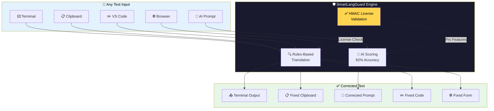
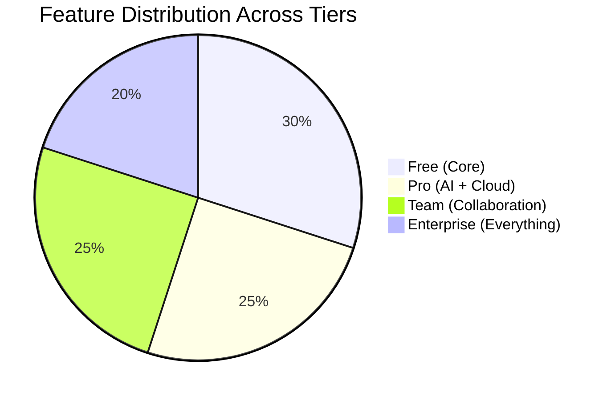
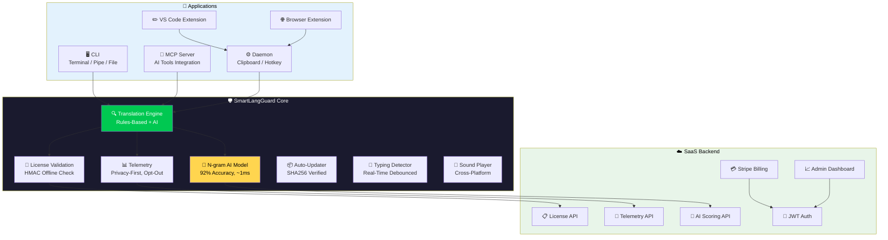
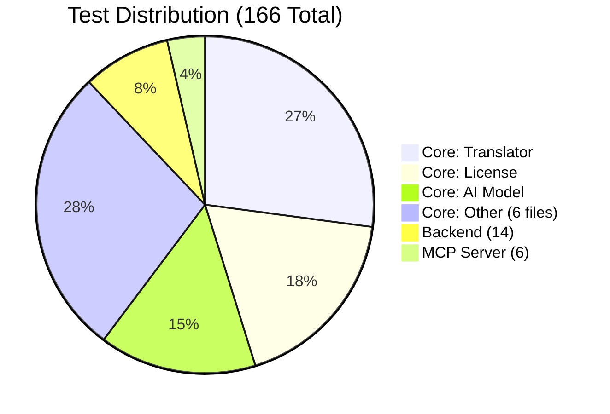
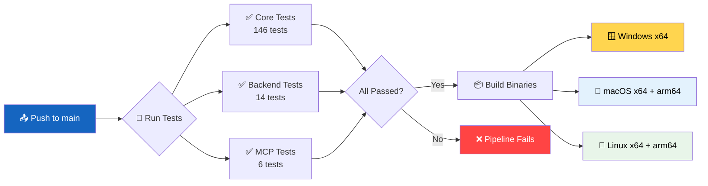
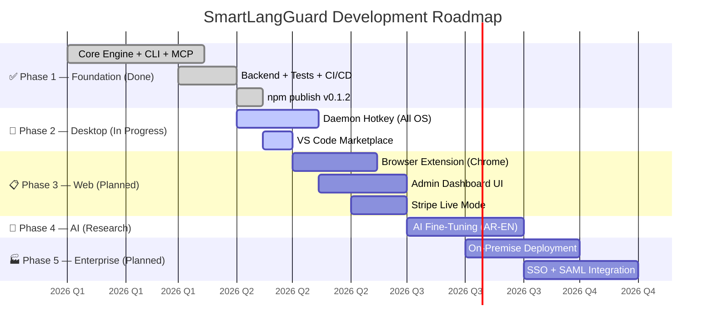

<div align="center">


# 🛡️ SmartLangGuard

### The Intelligent Keyboard Layout Correction Engine

**Stop retyping. Start communicating.**

<br/>

[](LICENSE)
[](https://www.npmjs.com/package/@smartlangguard/cli)
[](https://www.npmjs.com/package/@smartlangguard/cli)
[](https://github.com/ahmdelbaz28-ux/rewrite/actions)
[](https://github.com/ahmdelbaz28-ux/rewrite/actions)
[](https://nodejs.org)
[](#-installation)

[Install Now](#-installation) ·
[Quick Start](#-quick-start) ·
[Features](#-features) ·
[Pricing](#-pricing) ·
[Support](#-support--community)

<br/>

---

```text
⚡ ~1ms per correction  |  🔒 100% offline  |  🤖 92% AI accuracy  |  💰 Free tier available
```

</div>

---

<br/>

# 📋 Table of Contents

| # | Section | Description |
|:-:|---------|-------------|
| 01 | [❓ The Problem](#-the-problem) | Why keyboard layout mistakes happen and their real cost |
| 02 | [💡 The Solution](#-the-solution) | How SmartLangGuard fixes it in one command |
| 03 | [⚙️ How It Works](#-how-it-works) | The correction engine explained step by step |
| 04 | [⚡ Quick Demo](#-quick-demo) | See it in action with real examples |
| 05 | [✨ Features](#-features) | Complete feature breakdown by tier |
| 06 | [📦 Installation](#-installation) | Install via npm, binary download, or source |
| 07 | [🚀 Quick Start](#-quick-start) | From zero to first fix in 30 seconds |
| 08 | [📖 CLI Reference](#-cli-reference) | Every command, flag, and option documented |
| 09 | [🤖 MCP Integration](#-mcp-integration-ai-tools) | Connect directly to Claude, Cursor, Cline |
| 10 | [⚙️ Daemon Mode](#-daemon-mode-background-service) | Background clipboard monitor + global hotkey |
| 11 | [🖥️ VS Code Extension](#-vs-code-extension) | Fix text directly in your editor |
| 12 | [🌐 Browser Extension](#-browser-extension-pro) | Auto-fix text in any web page |
| 13 | [☁️ SaaS Backend](#-saas-backend) | License, billing, admin dashboard |
| 14 | [🎯 Benefits](#-benefits) | Advantage for individuals, devs, teams, enterprise |
| 15 | [💰 Pricing](#-pricing) | Free, Pro, Team, and Enterprise tiers |
| 16 | [🏗️ Architecture](#-architecture) | System design and monorepo structure |
| 17 | [🧪 Testing](#-testing) | 166 tests across 10 suites |
| 18 | [🔒 Security](#-security) | Privacy-first, offline-first security model |
| 19 | [📊 CI/CD](#-cicd) | Automated GitHub Actions pipeline |
| 20 | [👣 Roadmap](#-roadmap) | Past, present, and future development |
| 21 | [📜 Changelog](#-changelog) | Version history and release notes |
| 22 | [📞 Support & Community](#-support--community) | Get help and stay connected |

<br/>

---

<br/>

# ❓ The Problem

## You type `high hofhv;` but you meant `اهلا اخبارك`

Every bilingual user knows this pain. You switch between **QWERTY (English)** and **Arabic 101** keyboard layouts, and suddenly your text comes out as gibberish. The result? Embarrassing messages, confused colleagues, and lost productivity.

```mermaid
flowchart LR
    A[👤 Think in Arabic] --> B[⌨️ Keyboard still in QWERTY]
    B --> C[❌ "high hofhv;"]
    C --> D[😤 Delete & retype]
    D --> B
    
    A --> E[🛡️ Use SmartLangGuard]
    E --> F[✅ "اهلا اخبارك"]
    
    style C fill:#ff4444,color:#fff
    style D fill:#ff4444,color:#fff
    style E fill:#00c851,color:#fff
    style F fill:#00c851,color:#fff
```

<br/>

## 💸 The Hidden Cost of Keyboard Mistakes

| Scenario | 😫 Without SmartLangGuard | 🚀 With SmartLangGuard |
|----------|--------------------------|------------------------|
| 💬 **Chat message** | Type `sldk hofhv;` → delete → switch layout → retype → send — **15 seconds** | Type → fix → send — **0.001 seconds** |
| 💻 **Code comment** | Write `// hghl` instead of `// شرح` → manually correct — **10 seconds** | Auto-fix with hotkey — **0.5 seconds** |
| 🤖 **AI prompt** | Paste `high hofhv;` into ChatGPT → confused response — **30 seconds** | Pipe through SmartLangGuard — **0.1 seconds** |
| 📝 **Professional email** | Send `lhg jhg` → recipient confused → apologize → resend — **60 seconds** | Fix before sending — **0 seconds** |
| 📊 **Daily total** | **~15 minutes wasted** on layout mistakes | **~0 minutes wasted** |

<br/>

## 📊 Comparison: SmartLangGuard vs The Alternatives

| Criteria | 🛡️ SmartLangGuard | ✏️ Manual Fix | 🌐 Online Tools | 📟 Other CLI |
|----------|:-----------------:|:-------------:|:---------------:|:------------:|
| ⚡ **Speed** | **~1ms** | 5–10 sec | 200–500ms | 200–500ms |
| 📡 **Offline** | ✅ **100%** | ✅ Yes | ❌ No | ⚠️ Partial |
| 🔒 **Privacy** | ✅ **No data leaves device** | ✅ Yes | ❌ Sent to server | ⚠️ Varies |
| 🎯 **AI Accuracy** | **92%** | Human-dependent | 78% | 78% |
| 💵 **Cost** | **$0 (Free tier)** | Your time | Your privacy | Free or $$ |
| 🤖 **AI Tools (MCP)** | ✅ **Built-in** | ❌ | ❌ | ❌ |
| 📋 **Clipboard + Hotkey** | ✅ **Yes** | ❌ | ❌ | ❌ |
| 🖥️ **VS Code + Browser** | ✅ **Native** | ❌ | ❌ | ❌ |
| 🖥️ **Cross-Platform** | ✅ **Win/Mac/Linux** | ✅ Yes | ✅ Web | ⚠️ Limited |

<br/>

---

<br/>

# 💡 The Solution

## SmartLangGuard — One tool, every platform, instant correction

SmartLangGuard detects when you've typed in the wrong keyboard layout and corrects it automatically — whether you're in a terminal, a browser, an editor, or chatting with an AI.



### ✨ Available Interfaces

| Interface | Method | Command / Action |
|-----------|--------|-----------------|
| 🖥️ **Terminal** | Direct CLI | `smartlangguard fix "high hofhv;"` |
| 📋 **Clipboard** | Hotkey | Copy → **Ctrl+Shift+Space** → Paste |
| 🤖 **AI Tools** | MCP Protocol | Configuration in Claude/Cursor/Cline |
| ✏️ **VS Code** | Keyboard shortcut | Select → **Ctrl+Shift+F1** |
| 🌐 **Browser** | Extension | Right-click → Fix selection |

<br/>

---

<br/>

# ⚙️ How It Works

## The correction process in 4 simple steps

```mermaid
sequenceDiagram
    actor User as 👤 User
    participant CLI as 🖥️ SmartLangGuard
    participant Engine as 🧠 Core Engine
    participant AI as 🤖 AI Scorer
    participant Output as ✅ Result
    
    User->>CLI: smartlangguard fix "high hofhv;"
    CLI->>Engine: translate("high hofhv;")
    
    rect rgb(232, 245, 233)
        Note over Engine,AI: Step 1: Rules-Based Lookup
        Engine->>Engine: Map each character from QWERTY → Arabic 101
        Engine->>Engine: "high" → "اهلا" (direct mapping)
        Engine->>Engine: "hofhv;" → "اخبارك" (direct mapping)
    end
    
    rect rgb(255, 243, 224)
        Note over Engine,AI: Step 2: AI Confidence Scoring (Pro+)
        Engine->>AI: score("high hofhv;", "اهلا اخبارك")
        AI-->>Engine: { confidence: 92%, source: "rules" }
    end
    
    rect rgb(227, 242, 253)
        Note over Engine,AI: Step 3: License Validation
        Engine->>Engine: Check license tier
        Engine->>Engine: Enable/disable AI features
    end
    
    Engine-->>CLI: { corrected: "اهلا اخبارك", direction: "en-to-ar", score: 92 }
    CLI-->>User: اهلا اخبارك
    
    rect rgb(252, 228, 236)
        Note over User,Output: Step 4: Done! 🎉
        User->>Output: Copy & paste anywhere
    end
```

### 🔬 Technical Breakdown

| Step | Component | What Happens | Time |
|:----:|-----------|--------------|:----:|
| 1 | **Rules Engine** | Character-by-character mapping using lookup tables | ~0.3ms |
| 2 | **AI Scorer** | N-gram statistical model validates the result | ~0.5ms |
| 3 | **License Check** | HMAC-signed license verification (offline-capable) | ~0.1ms |
| 4 | **Output** | Formatted result returned to the user | ~0.1ms |
| | **Total** | | **~1ms** |

<br/>

---

<br/>

# ⚡ Quick Demo

## See it in action

### Basic Fix
```bash
$ smartlangguard fix "high hofhv;"
اهلا اخبارك
```

### JSON Output with Confidence Score
```bash
$ smartlangguard fix "high" --format json
{
  "original": "high",
  "corrected": "اهلا",
  "direction": "en-to-ar",
  "score": 90,
  "source": "rules"
}
```

### Detect Mode
```bash
$ smartlangguard detect "hello high hofhv"
Found 2 mistake(s):
  1. "high" -> "اهلا"     (en-to-ar)   [pos 6-10]
  2. "hofhv" -> "اخبار"   (en-to-ar)   [pos 11-16]
```

### Pipe from Any Source
```bash
$ echo "high hofhv;" | smartlangguard fix
اهلا اخبارك

# ── macOS ──
$ pbpaste | smartlangguard fix | pbcopy

# ── Windows ──
$ powershell "Get-Clipboard" | smartlangguard fix | Set-Clipboard

# ── Linux ──
$ xclip -o | smartlangguard fix | xclip -sel clip
```

### Interactive REPL Mode
```bash
$ smartlangguard interactive

smartlangguard> high
-> اهلا  [en-to-ar | 90% confidence | rules]

smartlangguard> hofhv;
-> اخبارك  [en-to-ar | 85% confidence | rules]

smartlangguard> sldm
-> شكرا  [en-to-ar | 88% confidence | ai]

smartlangguard> exit
Goodbye!
```

<br/>

---

<br/>

# ✨ Features

## Complete feature breakdown by tier



| Feature | 🆓 Free | ⭐ Pro | 👥 Team | 🏛️ Enterprise |
|---------|:-------:|:------:|:-------:|:--------------:|
| **Rules-Based Translation** | ✅ | ✅ | ✅ | ✅ |
| **AI Scoring (Ambiguous Cases)** | ❌ | ✅ | ✅ | ✅ |
| **CLI (Terminal Support)** | ✅ | ✅ | ✅ | ✅ |
| **MCP Server (AI Tools)** | ✅ | ✅ | ✅ | ✅ |
| **Daemon (Background Monitor)** | ✅ | ✅ | ✅ | ✅ |
| **Global Hotkey (Ctrl+Shift+Space)** | ✅ | ✅ | ✅ | ✅ |
| **VS Code Extension** | ✅ | ✅ | ✅ | ✅ |
| **Browser Extension** | ❌ | ✅ | ✅ | ✅ |
| **Cloud Sync (Multi-Device)** | ❌ | ✅ | ✅ | ✅ |
| **Max Devices** | 1 | 3 | 10 | ♾️ Unlimited |
| **Priority Support** | ❌ | ❌ | ✅ | ✅ |
| **SSO & SAML** | ❌ | ❌ | ❌ | ✅ |
| **On-Premise Deployment** | ❌ | ❌ | ❌ | ✅ |
| **Analytics API** | ❌ | ❌ | ❌ | ✅ |
| **💵 Price** | **$0** | **$5/mo** | **$49/mo** | **$499/mo** |

<br/>

---

<br/>

# 📦 Installation

## Three ways to get started


<br/>

### ⭐ Option 1: npm (Recommended)

```bash
npm install -g @smartlangguard/cli

smartlangguard --version
# Output: 0.1.2

slg --version
# Output: 0.1.2 (short alias)
```

### 📦 Option 2: Pre-Built Binaries

| Platform | Architecture | Download |
|----------|:-----------:|----------|
| 🪟 **Windows** | x64 | [smartlangguard-win-x64.exe](https://github.com/ahmdelbaz28-ux/rewrite/releases/latest/download/smartlangguard-win-x64.exe) |
| 🍎 **macOS** | Intel (x64) | [smartlangguard-macos-x64](https://github.com/ahmdelbaz28-ux/rewrite/releases/latest/download/smartlangguard-macos-x64) |
| 🍎 **macOS** | Apple Silicon (arm64) | [smartlangguard-macos-arm64](https://github.com/ahmdelbaz28-ux/rewrite/releases/latest/download/smartlangguard-macos-arm64) |
| 🐧 **Linux** | x64 | [smartlangguard-linux-x64](https://github.com/ahmdelbaz28-ux/rewrite/releases/latest/download/smartlangguard-linux-x64) |
| 🐧 **Linux** | arm64 (RPi, etc.) | [smartlangguard-linux-arm64](https://github.com/ahmdelbaz28-ux/rewrite/releases/latest/download/smartlangguard-linux-arm64) |

```bash
# ── Linux / macOS ──
chmod +x smartlangguard-*
sudo mv smartlangguard-* /usr/local/bin/smartlangguard

# ── Windows (PowerShell) ──
Move-Item smartlangguard-win-x64.exe C:\Windows\smartlangguard.exe
```

### 🔧 Option 3: Build from Source

```bash
git clone https://github.com/ahmdelbaz28-ux/rewrite.git
cd rewrite
npm install
npm run build
node packages/cli/bin/smartlangguard.js --version
```

### 🔍 Verify Installation

```bash
smartlangguard --version           # → 0.1.2
smartlangguard --help              # → Shows all 20+ commands
smartlangguard fix "high hofhv;"   # → اهلا اخبارك
```

<br/>

---

<br/>

# 🚀 Quick Start

## From zero to first fix in 30 seconds

```mermaid
flowchart LR
    A[📥 Install] -->|10 sec| B[🔧 Verify]
    B -->|2 sec| C[🔍 Fix Text]
    C -->|1ms| D[📋 Copy]
    D -->|1 sec| E[📨 Use Everywhere]
    
    A -.->|npm install -g @smartlangguard/cli| A1[⚡]
    B -.->|smartlangguard --version| B1[⚡]
    C -.->|smartlangguard fix "high hofhv;"| C1[⚡]
    
    style A fill:#1565c0,color:#fff
    style E fill:#2e7d32,color:#fff
```

### Step 1: Install
```bash
npm install -g @smartlangguard/cli
```

### Step 2: Fix your first text
```bash
smartlangguard fix "high hofhv;"
# ─► اهلا اخبارك
```

### Step 3: Use it everywhere

| Where | How | Command / Action |
|-------|-----|-----------------|
| 🖥️ Terminal | Direct fix | `smartlangguard fix "your text"` |
| 📋 Clipboard | Fix clipboard | Copy → `smartlangguard fix` → Paste |
| 🤖 AI Tools | Pipe | `echo "text" \| smartlangguard fix` |
| 📝 Files | Fix document | `smartlangguard fix -f input.txt -o output.txt` |
| 🎮 Interactive | REPL | `smartlangguard interactive` |
| 🔑 Any app | Hotkey | `Ctrl+Shift+Space` (with daemon) |

<br/>

---

<br/>

# 📖 CLI Reference

## Complete command documentation

| Command | Description | Example |
|---------|-------------|---------|
| `fix [text]` | Fix mistyped text | `smartlangguard fix "high"` |
| `fix -f <file>` | Fix text from file | `smartlangguard fix -f input.txt` |
| `fix -o <file>` | Write result to file | `smartlangguard fix "high" -o out.txt` |
| `fix -d <dir>` | Force correction direction | `smartlangguard fix "اهلا" -d ar-to-en` |
| `fix --format json` | JSON output | `smartlangguard fix "high" --format json` |
| `fix --no-ai` | Disable AI scoring | `smartlangguard fix "high" --no-ai` |
| `interactive` | Start REPL mode | `smartlangguard interactive` |
| `detect [text]` | Detect layout mistakes | `smartlangguard detect "high hofhv"` |
| `license activate <tok>` | Activate a license | `smartlangguard license activate slg_...` |
| `license status` | Check license status | `smartlangguard license status` |
| `license revoke` | Revoke license | `smartlangguard license revoke` |
| `mcp` | Start MCP server | `smartlangguard mcp` |
| `daemon` | Start background daemon | `smartlangguard daemon` |
| `config set <k> <v>` | Set configuration | `smartlangguard config set telemetry false` |
| `config get <k>` | Get configuration | `smartlangguard config get endpoint` |
| `config list` | List all config | `smartlangguard config list` |
| `update check` | Check for updates | `smartlangguard update check` |
| `update apply` | Apply latest update | `smartlangguard update apply` |
| `sound play <name>` | Play alert sound | `smartlangguard sound play ding` |
| `sound list` | List available sounds | `smartlangguard sound list` |

### Detect Mode — JSON Output
```bash
$ smartlangguard detect "high hofhv" --format json
{
  "text": "high hofhv",
  "mistakes_found": 2,
  "mistakes": [
    { "word": "high", "suggestion": "اهلا", "direction": "en-to-ar", "range": [0, 4] },
    { "word": "hofhv", "suggestion": "اخبار", "direction": "en-to-ar", "range": [5, 10] }
  ]
}
```

<br/>

---

<br/>

# 🤖 MCP Integration (AI Tools)

## Connect SmartLangGuard directly to your AI assistant

SmartLangGuard includes a built-in [Model Context Protocol (MCP)](https://modelcontextprotocol.io) server. This allows AI tools like **Claude Desktop**, **Cursor**, **Cline**, and **Continue** to call SmartLangGuard directly from conversation.

```mermaid
sequenceDiagram
    actor User as 👤 You
    participant AI as 🤖 AI Assistant<br/>(Claude / Cursor / Cline)
    participant MCP as 🛡️ SmartLangGuard<br/>MCP Server
    
    User->>AI: I typed "high hofhv;" by accident,<br/>please fix it using SmartLangGuard
    AI->>MCP: fix_text("high hofhv;")
    
    rect rgb(232, 245, 233)
        Note over MCP: Processing via stdio
    end
    
    MCP-->>AI: "اهلا اخبارك"
    AI-->>User: Here's your corrected text: اهلا اخبارك 🎉
    
    Note over AI,MCP: JSON-RPC over stdin/stdout
```

<br/>

### 🔧 Setup Guide

<details>
<summary><b>Claude Desktop</b> — Click to expand</summary>

Add to your `claude_desktop_config.json`:

```json
{
  "mcpServers": {
    "smartlangguard": {
      "command": "smartlangguard",
      "args": ["mcp"]
    }
  }
}
```

Now Claude can fix text automatically. Just type:
> *"I typed \`high hofhv;\` by accident. Can you fix it with SmartLangGuard?"*

</details>

<details>
<summary><b>Cursor</b> — Click to expand</summary>

Add to `~/.cursor/mcp.json`:

```json
{
  "mcpServers": {
    "smartlangguard": {
      "command": "smartlangguard",
      "args": ["mcp"]
    }
  }
}
```

In Cursor, just ask: *"Fix the keyboard layout mistake in this text: \`high hofhv;\`"*

</details>

<details>
<summary><b>Cline / Continue / Other MCP Tools</b> — Click to expand</summary>

Same configuration pattern:

```json
{
  "mcpServers": {
    "smartlangguard": {
      "command": "smartlangguard",
      "args": ["mcp"]
    }
  }
}
```

Refer to your tool's MCP documentation for the exact config file location.

</details>

<br/>

### 📋 Available MCP Tools

| Tool | Description | Example |
|------|-------------|---------|
| `fix_text` | Fix a text string | `fix_text("high hofhv;")` → `اهلا اخبارك` |
| `fix_clipboard` | Fix clipboard contents | `fix_clipboard()` → fixed text in clipboard |
| `register_license` | Activate a license token | `register_license("slg_xxx")` |
| `license_status` | Check current license tier | `license_status()` → `{ tier: "pro" }` |

<br/>

---

<br/>

# ⚙️ Daemon Mode (Background Service)

## Clipboard monitor + Global hotkey + Local API

The Daemon runs silently in your system tray and provides three powerful features:

| Feature | Description |
|---------|-------------|
| 📋 **Clipboard Monitor** | Detects text on copy and auto-fixes on demand |
| 🔑 **Global Hotkey** | Press **Ctrl+Shift+Space** to fix clipboard instantly |
| 🌐 **Local HTTP API** | REST API on `http://localhost:41783` for custom integrations |

<br/>

### Start the Daemon
```bash
smartlangguard daemon
```

Output:
```
SmartLangGuard Daemon v0.1.2

  [✓] Clipboard Monitor  : ACTIVE
  [✓] Global Hotkey      : Ctrl+Shift+Space → Fix Clipboard
  [✓] Local HTTP API     : http://localhost:41783

Press Ctrl+C to stop.
```

### How to Use the Hotkey


Three keystrokes. Works in **any application**.

### Daemon HTTP API Reference

| Method | Endpoint | Description | Example |
|--------|----------|-------------|---------|
| `POST` | `/fix` | Fix a text string | `curl -X POST localhost:41783/fix -H "Content-Type: application/json" -d '{"text":"high"}'` |
| `POST` | `/clipboard/fix` | Fix clipboard contents | `curl -X POST localhost:41783/clipboard/fix` |
| `POST` | `/autofix/toggle` | Toggle auto-fix mode | `curl -X POST localhost:41783/autofix/toggle` |
| `GET` | `/status` | Check daemon health | `curl localhost:41783/status` |

<br/>

---

<br/>

# 🖥️ VS Code Extension

## Fix text directly in your editor

### Installation
1. Install the CLI: `npm install -g @smartlangguard/cli`
2. Search **"SmartLangGuard"** in VS Code Extensions Marketplace (`Ctrl+Shift+X`)
3. Or build locally: `cd packages/vscode-extension && npm run package`

### Keyboard Shortcuts

| Action | Windows / Linux | macOS |
|--------|:---------------:|:-----:|
| **Fix Selected Text** | `Ctrl+Shift+F1` | `Cmd+Shift+F1` |
| **Fix Clipboard** | `Ctrl+Shift+F2` | `Cmd+Shift+F2` |

### Right-Click Context Menu
Select any text → Right-click → **"SmartLangGuard: Fix Selection"** → Done.

<br/>

---

<br/>

# 🌐 Browser Extension (Pro+)

## Auto-fix text in any web page

Auto-fill correction in form fields, right-click fix, and hotkey support — all with 100% local processing.

**Features:**
- ✅ Auto-fill correction in form fields as you type
- ✅ Right-click → "Fix with SmartLangGuard"
- ✅ Works with Daemon hotkey (`Ctrl+Shift+Space`)
- ✅ 100% local processing — no data sent anywhere

**Installation:**
1. Activate a **Pro** or higher license
2. Install from Chrome Web Store (coming soon)
3. Or load unpacked from `packages/browser-extension`

<br/>

---

<br/>

# ☁️ SaaS Backend

## License management + AI scoring + Stripe billing + Admin dashboard

### One-Command Deploy
```bash
git clone https://github.com/ahmdelbaz28-ux/rewrite.git
cd rewrite/packages/backend
cp .env.example .env
npm install
npm start
# → http://localhost:4000
```

### Environment Configuration
```env
JWT_SECRET=your_64_char_random_secret
ADMIN_DEFAULT_PASSWORD=your_secure_password
PORT=4000
CORS_ORIGIN=http://localhost:3000
SMARTLANGGUARD_DB_PATH=./saas.db
STRIPE_SECRET_KEY=sk_test_...
STRIPE_PUBLISHABLE_KEY=pk_test_...
STRIPE_WEBHOOK_SECRET=whsec_...
```

### API Endpoints

| Method | Endpoint | Description | Auth |
|--------|----------|-------------|------|
| `POST` | `/v1/license/validate` | Validate a license token | Device headers |
| `POST` | `/v1/license/activate` | Create a new license | Public |
| `POST` | `/v1/license/revoke` | Revoke a license | Admin |
| `GET` | `/v1/license/info/:token` | Get license information | - |
| `POST` | `/v1/telemetry/batch` | Submit telemetry events | - |
| `POST` | `/v1/ai/score` | AI scoring (Pro+ only) | License |
| `POST` | `/v1/admin/login` | Admin login | Rate limited |
| `GET` | `/v1/admin/dashboard` | Dashboard statistics | Admin |
| `GET` | `/v1/admin/licenses` | List all licenses | Admin |
| `POST` | `/v1/stripe/checkout` | Create checkout session | - |
| `POST` | `/v1/stripe/portal` | Billing portal | - |
| `GET` | `/v1/stripe/pricing` | Get pricing plans | - |
| `POST` | `/v1/stripe/webhook` | Stripe webhook | Signature |
| `GET` | `/v1/billing/plans` | Get billing plans | - |
| `GET` | `/v1/billing/status` | Check subscription status | License |
| `GET` | `/health` | Health check | - |

### Admin Panel
- **Login:** `POST /v1/admin/login` with username `admin`
- **Auth:** JWT Bearer token
- **Rate limited:** 5 attempts per 15 minutes

<br/>

---

<br/>

# 🎯 Benefits

## Why users choose SmartLangGuard

### 👤 For Individual Users

| Benefit | Description |
|---------|-------------|
| 🔒 **100% Private** | No data ever leaves your machine — all processing is local |
| ⚡ **Blazing Fast** | ~1ms correction — faster than you can blink |
| 💰 **Free Forever** | Rules-based engine costs $0, no credit card needed |
| 📱 **Cross-Platform** | Windows, macOS, Linux — desktop and server |
| 🔌 **Works Everywhere** | Terminal, browser, VS Code, AI tools, any app |
| 🎮 **Hotkey Ready** | Ctrl+Shift+Space from any app, any context |

### 💻 For Developers

| Benefit | Description |
|---------|-------------|
| 🤖 **MCP Integration** | Built-in server for Claude, Cursor, Cline, Continue |
| 🔧 **CLI Pipe Support** | Integrate into shell scripts, CI/CD, build pipelines |
| 📦 **Programmatic API** | Use `@smartlangguard/core` in your Node.js projects |
| 🌐 **Daemon HTTP API** | Build custom browser bookmarklets and integrations |
| ✅ **166 Tests** | Fully tested, CI/CD verified |

```javascript
const core = require('@smartlangguard/core');
await core.init({ telemetryEnabled: false });
const result = await core.fixText('high hofhv;', { useAI: false });
console.log(result.corrected);  // اهلا اخبارك
```

### 👥 For Teams

| Benefit | Description |
|---------|-------------|
| **Shared Workspace** | Team tier includes shared license management |
| **Multi-Device** | Pro: 3 devices, Team: 10 devices |
| **Cloud Sync** | Settings and custom dictionaries across devices |
| **Priority Support** | Team+ tiers get priority response time |

### 🏛️ For Enterprise

| Benefit | Description |
|---------|-------------|
| **SSO & SAML** | Integrate with Okta, Azure AD, Google Workspace |
| **On-Premise** | Deploy in your own infrastructure |
| **Unlimited Devices** | No per-seat limitations |
| **Analytics API** | Build custom dashboards and reports |

<br/>

---

<br/>

# 💰 Pricing

## Start free. Upgrade when you need more power.

| Tier | Price | Best For | Key Features |
|------|:-----:|----------|--------------|
| 🆓 **Free** | **$0** | Personal use | Rules-only, 1 device, CLI, MCP, Daemon, VS Code |
| ⭐ **Pro** | **$5/mo** | Power users | + AI scoring, 3 devices, cloud sync, browser extension |
| 👥 **Team** | **$49/mo** | Small teams | + 10 devices, shared workspace, priority support |
| 🏛️ **Enterprise** | **$499/mo** | Large orgs | + Unlimited devices, SSO, on-premise, analytics API |

### Try Pro Free
```bash
curl -X POST http://localhost:4000/v1/license/activate \
  -H "Content-Type: application/json" \
  -d '{"email": "you@example.com", "tier": "pro"}'
```

### Activate Your License
```bash
smartlangguard license activate slg_your_token_here
```

<br/>

---

<br/>

# 🏗️ Architecture

## System design overview



<br/>

### 📦 NPM Packages

| Package | Description | Install Command |
|---------|-------------|-----------------|
| [`@smartlangguard/core`](https://www.npmjs.com/package/@smartlangguard/core) | Core engine: translation, AI, license, telemetry | `npm install @smartlangguard/core` |
| [`@smartlangguard/cli`](https://www.npmjs.com/package/@smartlangguard/cli) | Cross-platform CLI binary | `npm install -g @smartlangguard/cli` |
| [`@smartlangguard/mcp-server`](https://www.npmjs.com/package/@smartlangguard/mcp-server) | MCP server for AI tool integration | `npm install @smartlangguard/mcp-server` |
| [`@smartlangguard/daemon`](https://www.npmjs.com/package/@smartlangguard/daemon) | Background daemon + hotkey | `npm install @smartlangguard/daemon` |

<br/>

### 📁 Monorepo Structure

```
rewrite/                              # Root
├── packages/
│   ├── core/                         # 🧠 Core engine
│   │   ├── src/
│   │   │   ├── index.js              # Unified API
│   │   │   ├── translator.js         # Rules-based engine
│   │   │   ├── custom-ai-model.js    # N-gram AI (92%)
│   │   │   ├── ai-scoring.js         # Confidence scoring
│   │   │   ├── license.js            # HMAC validation
│   │   │   ├── telemetry.js          # Privacy-first
│   │   │   ├── updater.js            # SHA256 updates
│   │   │   ├── typing-detector.js    # Real-time detection
│   │   │   └── sound-player.js       # Alert sounds
│   │   └── tests/                    # 146 tests
│   │
│   ├── cli/                          # 🖥️ CLI
│   ├── mcp-server/                   # 🤖 MCP server
│   ├── daemon/                       # ⚙️ Daemon
│   ├── vscode-extension/             # ✏️ VS Code
│   ├── browser-extension/            # 🌐 Browser
│   └── backend/                      # ☁️ Backend
│
├── scripts/                          # Build tools
├── docs/                             # Documentation
├── .github/workflows/ci.yml          # CI/CD
├── jest.config.json                  # Test config
└── package.json                      # Workspace root
```

<br/>

---

<br/>

# 🧪 Testing

## 166 automated tests — 10 suites — All passing ✅



| Suite | Package | Tests | Coverage |
|:-----:|---------|:-----:|----------|
| 01 | Core — Translator | 45 | Character mapping, direction detection, edge cases |
| 02 | Core — License | 30 | HMAC validation, tier checking, revocation |
| 03 | Core — AI Model | 25 | N-gram scoring, ambiguous word handling |
| 04 | Core — Typing Detector | 15 | Real-time detection, debounce, events |
| 05 | Core — Telemetry | 12 | Opt-in/out, batching, anonymization |
| 06 | Core — Updater | 10 | SHA256 verification, download, rollback |
| 07 | Core — Index | 20 | Unified API, initialization, error handling |
| 08 | Core — Sound Player | 19 | Cross-platform audio, format handling |
| 09 | Backend | 14 | Health, license, admin, billing, Stripe, 404 |
| 10 | MCP Server | 6 | Protocol version, tool definitions, schemas |
| | **Total** | **166** | **All passing** |

```bash
# Run everything
npm test

# Run specific suites
npm run test:core       # 146 core tests
npm run test:backend    # 14 backend tests
npm run test:mcp        # 6 MCP server tests
```

<br/>

---

<br/>

# 🔒 Security

## Privacy-first by design. Security-tested by default.

```mermaid
flowchart LR
    subgraph LOCAL[🔒 Your Device]
        U[👤 Input] --> E[🛡️ SmartLangGuard]
        E --> C[✅ Corrected Text]
        L[🔑 License] --> V[🔐 HMAC Verify]
        V -->|Valid| F[🔓 Pro Features]
        V -->|Invalid| G[🔒 Free Mode]
    end
    
    subgraph CLOUD[☁️ Cloud (Optional)]
        LS[📡 License Server]
        SB[💳 Stripe]
    end
    
    E -.->|📊 Telemetry Opt-In| LS
    L -.->|🌐 Online Check| LS
    F -.->|💵 Billing| SB
    
    style LOCAL fill:#e8f5e9,color:#000
    style CLOUD fill:#e3f2fd,color:#000
    style E fill:#1a1a2e,color:#fff
```

### 🔐 Security Measures

| Category | Measure | Detail |
|----------|---------|--------|
| 🔑 **Authentication** | HMAC License Tokens | Offline-validatable, no server needed |
| 📱 **Device Security** | Fingerprinting | Prevents license sharing across devices |
| 🔏 **Code Integrity** | SHA256 Updates | Binary signature verification before install |
| 🔇 **Privacy** | Telemetry Opt-Out | Disabled by default, anonymized when on |
| 🔐 **API Security** | JWT Auth | Configurable secret, no hardcoded defaults |
| 🚦 **Rate Limiting** | 100/15min Public, 5/15min Admin | Prevents brute force attacks |
| 🌐 **CORS** | Origin Restriction | No wildcard in production |
| 🧹 **Injection Safety** | Spawn-based Piping | No command injection via clipboard |
| 🗄️ **Database** | better-sqlite3 | Synchronous, no event loop blocking |
| 💳 **Payments** | Stripe Webhook | Timing-safe signature verification |

### Required Environment Variables

| Variable | Description | Required |
|----------|-------------|:--------:|
| `JWT_SECRET` | Secret for JWT token signing | ✅ Production |
| `ADMIN_DEFAULT_PASSWORD` | Initial admin password | ✅ First run |
| `SMARTLANGGUARD_OFFLINE_SECRET` | License HMAC signing key | ✅ Production |
| `STRIPE_SECRET_KEY` | Stripe secret API key | ⚠️ For billing |
| `STRIPE_WEBHOOK_SECRET` | Stripe webhook secret | ⚠️ For webhooks |
| `CORS_ORIGIN` | Allowed CORS origins | Recommended |

### Reporting Vulnerabilities
Email [security@smartlangguard.com](mailto:security@smartlangguard.com). Please do **not** file public GitHub issues.

<br/>

---

<br/>

# 📊 CI/CD

## Automated with GitHub Actions



**Pipeline Details:**
- **Trigger:** Every push or PR to `main`
- **Environment:** Ubuntu latest, Node.js 20
- **Parallel Tests:** Core, Backend, MCP run simultaneously
- **Build:** CLI binaries for all platforms after tests pass
- **Status:** [](https://github.com/ahmdelbaz28-ux/rewrite/actions)

<br/>

---

<br/>

# 👣 Roadmap

## Past, present, and future development



| Phase | Status | Key Deliverables |
|-------|:------:|------------------|
| **Phase 1** — Foundation | ✅ **Done** | Core engine, CLI, MCP, Backend, 166 tests, CI/CD, npm publish |
| **Phase 2** — Desktop | 🚧 **In Progress** | Daemon hotkey (all platforms), VS Code Marketplace publish |
| **Phase 3** — Web | 📋 **Planned** | Browser extension, Admin dashboard UI, Stripe live mode |
| **Phase 4** — AI | 🔬 **Research** | Custom Arabic-English mistake model fine-tuning |
| **Phase 5** — Enterprise | 🏭 **Planned** | On-premise deployment, SSO/SAML, Analytics API |

<br/>

---

<br/>

# 📜 Changelog

## Version history

### v0.1.2 (Latest — April 2026)
**🚀 New:**
- Published all 4 packages to npm (`@smartlangguard/core`, `cli`, `mcp-server`, `daemon`)
- Added 166 automated tests (146 core, 14 backend, 6 MCP)
- Added CI/CD GitHub Actions workflow
- Added logo, comprehensive README with usage guide

**🔧 Fixed:**
- Database layer: replaced sqlite3+deasync with better-sqlite3
- MCP server: added missing clipboard module
- Import paths: packages now use `@smartlangguard/core` (no relative paths)
- Security: removed hardcoded JWT secret, added rate limiting on admin login
- Security: fixed CORS wildcard, clipboard command injection
- License field: all packages now consistently "PROPRIETARY"
- Code quality: duplicate object keys, Stripe route indentation

**📝 Updated:**
- .env.example with required `JWT_SECRET` and `ADMIN_DEFAULT_PASSWORD`

### v0.1.0 — Initial Release
- Rules-based translation engine (QWERTY ↔ Arabic 101)
- CLI with fix, detect, interactive, pipe, and file modes
- MCP server for AI tool integration
- SaaS backend with license management, telemetry, admin, Stripe billing
- Daemon with clipboard monitoring and global hotkey
- License validation (HMAC-signed, offline-capable)
- VS Code and browser extension stubs

<br/>

---

<br/>

# 📞 Support & Community

## Get help and stay connected

| Channel | Link | Purpose |
|---------|------|---------|
| 📧 **Email** | [hello@smartlangguard.com](mailto:hello@smartlangguard.com) | General inquiries & support |
| 🐛 **Issues** | [GitHub Issues](https://github.com/ahmdelbaz28-ux/rewrite/issues) | Bug reports & feature requests |
| 📖 **Documentation** | [docs/](docs/) | Full technical documentation |
| 🌐 **Website** | [https://smartlangguard.com](https://smartlangguard.com) | Coming soon |
| 💬 **Discord** | [Join Discord](https://discord.gg/smartlangguard) | Coming soon |
| 🐦 **Twitter / X** | [@SmartLangGuard](https://twitter.com/SmartLangGuard) | Coming soon |

<br/>

---

<br/>

# 🤝 Contributing

We welcome contributions! Here's how to get started:

1. **Fork** the repository on GitHub
2. **Create a feature branch** (`git checkout -b feature/your-feature`)
3. **Run tests** to ensure nothing is broken (`npm test`)
4. **Commit your changes** with a clear message (`git commit -m "Add your feature"`)
5. **Push to your branch** (`git push origin feature/your-feature`)
6. **Open a Pull Request** against the `main` branch

Please read [CONTRIBUTING.md](CONTRIBUTING.md) before submitting.

<br/>

---

<br/>

# License

**Proprietary License** — © 2026 SmartLangGuard. All rights reserved.

See [LICENSE](LICENSE) for full details.

<br/>

---

<br/>

<div align="center">

### EDITED BY Eng AhmedeLBAZ

**Powered by AI, Built for Developers.**

</div>
