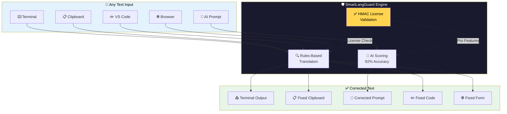
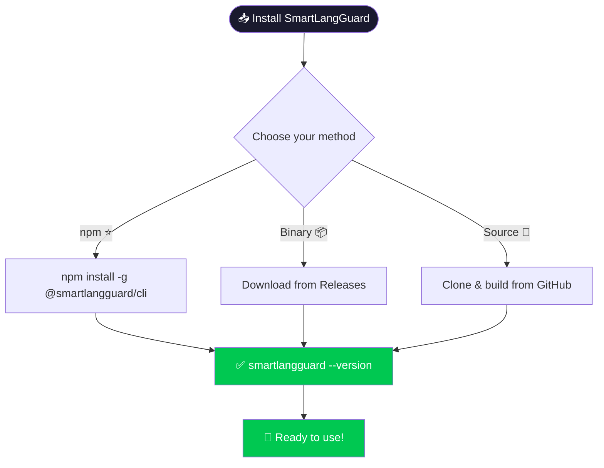
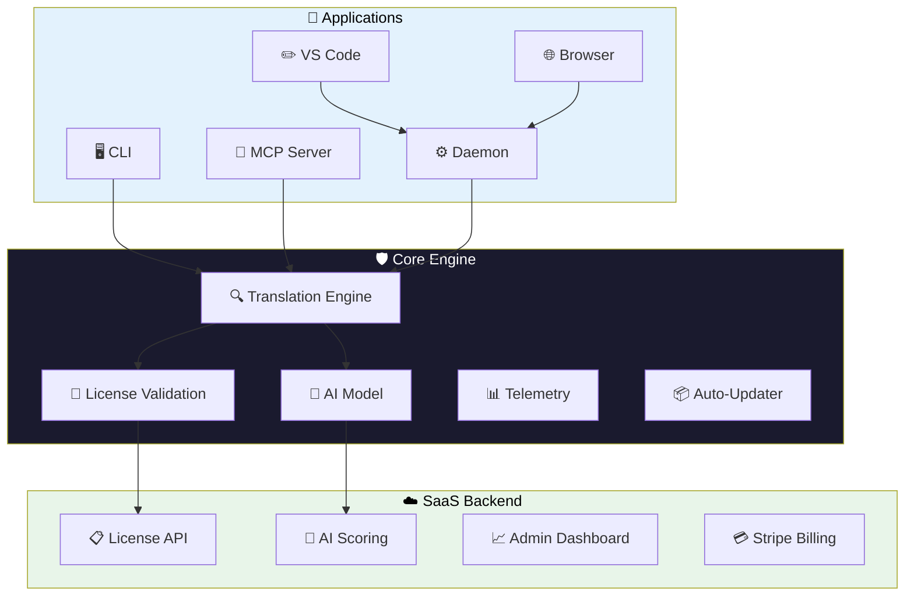
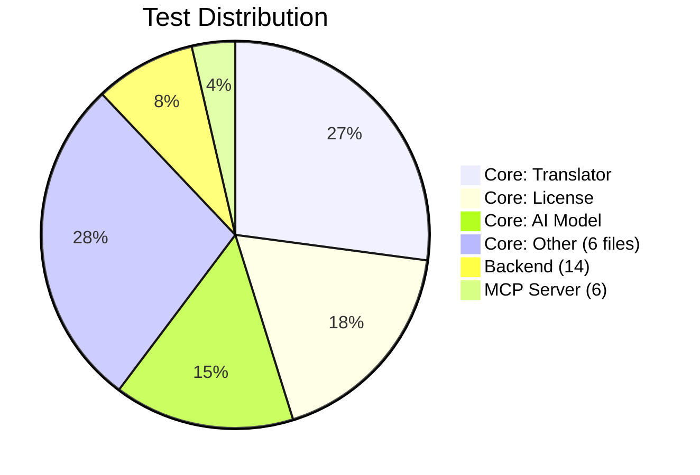
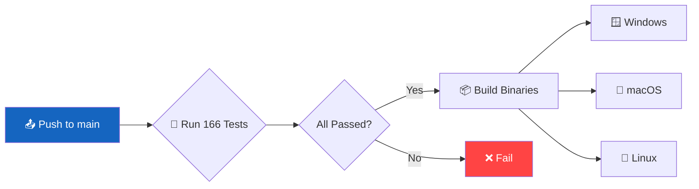
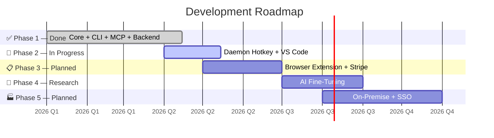

<div align="center">


# 🛡️ SmartLangGuard

### The Intelligent Keyboard Layout Correction Engine

**Stop retyping. Start communicating.**

<br/>

[](LICENSE)
[](https://www.npmjs.com/package/@smartlangguard/cli)
[](https://www.npmjs.com/package/@smartlangguard/cli)
[](https://github.com/ahmdelbaz28-ux/rewrite/actions)
[](https://github.com/ahmdelbaz28-ux/rewrite/actions)
[](https://nodejs.org)
[](#-installation)

[Install Now](#-installation) ·
[All Usage Methods](#-usage-methods) ·
[Quick Start](#-quick-start) ·
[Features](#-features) ·
[Pricing](#-pricing) ·
[Support](#-support--community)

<br/>

---

```text
⚡ ~1ms per correction  |  🔒 100% offline  |  🤖 92% AI accuracy  |  💰 Free tier available
```

</div>

---

<br/>

# 📋 Table of Contents

| # | Section | Description |
|:-:|---------|-------------|
| 01 | [❓ The Problem](#-the-problem) | Why keyboard layout mistakes happen |
| 02 | [💡 The Solution](#-the-solution) | How SmartLangGuard fixes it |
| 03 | [⚙️ How It Works](#-how-it-works) | The engine explained step by step |
| 04 | [⚡ Quick Demo](#-quick-demo) | See it in action |
| 05 | [🎯 All Usage Methods](#-usage-methods) | **Every way to use the program** + install guide |
| 06 | [✨ Features](#-features) | Feature breakdown by tier |
| 07 | [📦 Installation](#-installation) | Install via npm, binary, or source |
| 08 | [🚀 Quick Start](#-quick-start) | From zero to first fix |
| 09 | [📖 CLI Reference](#-cli-reference) | All commands documented |
| 10 | [🤖 MCP Integration](#-mcp-integration-ai-tools) | Connect to Claude, Cursor, Cline |
| 11 | [⚙️ Daemon Mode](#-daemon-mode-background-service) | Background service + hotkey |
| 12 | [🖥️ VS Code Extension](#-vs-code-extension) | Fix text in your editor |
| 13 | [🌐 Browser Extension](#-browser-extension-pro) | Fix text in any web page |
| 14 | [☁️ SaaS Backend](#-saas-backend) | License, billing, admin |
| 15 | [🎯 Benefits](#-benefits) | Why choose SmartLangGuard |
| 16 | [💰 Pricing](#-pricing) | Free, Pro, Team, Enterprise |
| 17 | [🏗️ Architecture](#-architecture) | System design |
| 18 | [🧪 Testing](#-testing) | 166 tests across 10 suites |
| 19 | [🔒 Security](#-security) | Privacy-first security model |
| 20 | [📊 CI/CD](#-cicd) | GitHub Actions pipeline |
| 21 | [👣 Roadmap](#-roadmap) | Development plan |
| 22 | [📜 Changelog](#-changelog) | Version history |
| 23 | [📞 Support & Community](#-support--community) | Get help and stay connected |

<br/>

---

<br/>

# ❓ The Problem

## You type `high hofhv;` but you meant `اهلا اخبارك`

Every bilingual user knows this pain. You switch between **QWERTY (English)** and **Arabic 101** keyboard layouts, and suddenly your text comes out as gibberish.

```mermaid
flowchart LR
    A[👤 Think in Arabic] --> B[⌨️ Keyboard still in QWERTY]
    B --> C[❌ "high hofhv;"]
    C --> D[😤 Delete & retype]
    D --> B
    
    A --> E[🛡️ Use SmartLangGuard]
    E --> F[✅ "اهلا اخبارك"]
    
    style C fill:#ff4444,color:#fff
    style D fill:#ff4444,color:#fff
    style E fill:#00c851,color:#fff
    style F fill:#00c851,color:#fff
```

<br/>

## 💸 The Real Cost

| Without SmartLangGuard | With SmartLangGuard |
|------------------------|-------------------|
| 😤 Type → Delete → Switch layout → Retype → Send | ⌨️ Type → ⚡ Fix → ✅ Send |
| ⏱️ **15–30 seconds** per mistake | ⚡ **~1 millisecond** |
| 😫 **~15 minutes wasted daily** | ✅ **~0 minutes wasted** |

<br/>

## 📊 SmartLangGuard vs Alternatives

| Criteria | 🛡️ SmartLangGuard | ✏️ Manual Fix | 🌐 Online Tools | 📟 Other CLI |
|----------|:-----------------:|:-------------:|:---------------:|:------------:|
| ⚡ **Speed** | **~1ms** | 5–10 sec | 200–500ms | 200–500ms |
| 📡 **Offline** | ✅ **100%** | ✅ Yes | ❌ No | ⚠️ Partial |
| 🔒 **Privacy** | ✅ **No data leaves device** | ✅ Yes | ❌ Sent to server | ⚠️ Varies |
| 🎯 **Accuracy** | **92% AI** | Human error | 78% | 78% |
| 💵 **Cost** | **$0 Free tier** | Your time | Your privacy | Free or $ |
| 🤖 **AI Tools** | ✅ **Built-in MCP** | ❌ | ❌ | ❌ |
| 🔑 **Hotkey** | ✅ **Ctrl+Shift+Space** | ❌ | ❌ | ❌ |

<br/>

---

<br/>

# 💡 The Solution

## One tool — every platform — instant correction



<br/>

---

<br/>

# ⚡ Quick Demo

## See it in action

### 🔹 Basic Fix
```bash
$ smartlangguard fix "high hofhv;"
اهلا اخبارك
```

### 🔹 JSON Output with Score
```bash
$ smartlangguard fix "high" --format json
{
  "original": "high",
  "corrected": "اهلا",
  "direction": "en-to-ar",
  "score": 90,
  "source": "rules"
}
```

### 🔹 Detect Mistakes
```bash
$ smartlangguard detect "hello high hofhv"
Found 2 mistake(s):
  1. "high" -> "اهلا"     (en-to-ar)   [pos 6-10]
  2. "hofhv" -> "اخبار"   (en-to-ar)   [pos 11-16]
```

### 🔹 Pipe from Any Source
```bash
$ echo "high hofhv;" | smartlangguard fix
اهلا اخبارك
```

### 🔹 Interactive Mode
```bash
$ smartlangguard interactive
smartlangguard> high
-> اهلا  [en-to-ar | 90% confidence | rules]
smartlangguard> hofhv;
-> اخبارك  [en-to-ar | 85% confidence | rules]
smartlangguard> exit
Goodbye!
```

<br/>

---

<br/>

# 🎯 Usage Methods

## All the ways to use SmartLangGuard — explained for everyone

> 💡 **Don't know how to code? No problem!** Each method below shows you exactly what to do, step by step. You only need ONE method that works for you.

<br/>

<!-- ============================================================ -->
<!-- METHOD 1 -->
<!-- ============================================================ -->

## 🔹 Method 1: Direct Terminal Fix

> **🎯 What it does:** You type a command in the terminal, and SmartLangGuard fixes your text instantly. Best for quick corrections.

<br/>

<table>
<tr>
<td width="50%">

### 🛠️ How to Install (First Time Only)

**Step 1:** Open **Terminal** (macOS/Linux) or **Command Prompt** / **PowerShell** (Windows).

**Step 2:** Copy-paste this line and press Enter:

```bash
npm install -g @smartlangguard/cli
```

⏳ Wait 10–20 seconds for it to finish.

**Step 3:** Verify it worked:

```bash
smartlangguard --version
```

If you see `0.1.2` — you're ready! ✅

</td>
<td width="50%">

### ▶️ How to Use It

**Every time you need to fix text:**

```bash
smartlangguard fix "your mistyped text here"
```

**Real example:**

```bash
smartlangguard fix "high hofhv;"
```

**Result:**
```
اهلا اخبارك
```

### 📋 More Examples

| Command | Result |
|---------|--------|
| `smartlangguard fix "high"` | `اهلا` |
| `smartlangguard fix "sldm"` | `شكرا` |
| `smartlangguard fix "hg` | `ش` |

</td>
</tr>
</table>

---

<br/>

<!-- ============================================================ -->
<!-- METHOD 2 -->
<!-- ============================================================ -->

## 🔹 Method 2: Clipboard Quick Fix (No Typing Needed!)

> **🎯 What it does:** Copy any text → Press a key combination → Paste the fixed version. **No commands needed after setup!** Works in any app (Word, Chrome, WhatsApp, Telegram...).

<br/>

<table>
<tr>
<td width="50%">

### 🛠️ How to Install (First Time Only)

**Step 1:** Open **Terminal** / **Command Prompt**.

**Step 2:** Install the program:

```bash
npm install -g @smartlangguard/cli
```

**Step 3:** Start the background service:

```bash
smartlangguard daemon
```

You'll see:
```
SmartLangGuard Daemon v0.1.2
[OK] Clipboard Monitor: ACTIVE
[OK] Global Hotkey: Ctrl+Shift+Space
[OK] Local HTTP API: http://localhost:41783
```

✅ **Keep this window open** in the background. Minimize it.

</td>
<td width="50%">

### ▶️ How to Use It (Every Day)

**Step 1:** Select the mistyped text **anywhere** (Word, browser, chat).

**Step 2:** Press **Ctrl+C** to copy it.

**Step 3:** Press **Ctrl+Shift+Space** (the hotkey).

**Step 4:** Press **Ctrl+V** to paste the fixed text.

### 🎬 Visual Guide

```
1. 📋 Select text → Ctrl+C
                ↓
2. 🔑 Press Ctrl+Shift+Space
                ↓
3. 📋 Press Ctrl+V → Text is fixed! ✅
```

**That's it!** Works in any app — no commands needed after setup.

</td>
</tr>
</table>

---

<br/>

<!-- ============================================================ -->
<!-- METHOD 3 -->
<!-- ============================================================ -->

## 🔹 Method 3: Interactive Mode (Chat-Like)

> **🎯 What it does:** Opens a chat-like interface where you type text and get corrections instantly. Like having a conversation with the program.

<br/>

<table>
<tr>
<td width="50%">

### 🛠️ How to Install (First Time Only)

**Step 1:** Open **Terminal** / **Command Prompt**.

**Step 2:** Install:

```bash
npm install -g @smartlangguard/cli
```

✅ Done! No other setup needed.

</td>
<td width="50%">

### ▶️ How to Use It

**Step 1:** Run this command:

```bash
smartlangguard interactive
```

**Step 2:** Start typing! The program will fix each line:

```
smartlangguard> high
-> اهلا  [en-to-ar | 90% confidence]

smartlangguard> hofhv;
-> اخبارك  [en-to-ar | 85% confidence]

smartlangguard> sldm lhgi
-> شكرا جزيلا  [en-to-ar | 88% confidence]
```

**Step 3:** Type `exit` or press `Ctrl+C` to quit.

</td>
</tr>
</table>

---

<br/>

<!-- ============================================================ -->
<!-- METHOD 4 -->
<!-- ============================================================ -->

## 🔹 Method 4: Pipe Mode (For AI Tools & Scripts)

> **🎯 What it does:** Send text FROM any program TO SmartLangGuard and get the fixed version back. Perfect for AI tools like ChatGPT, Claude, or for fixing text in scripts.

<br/>

<table>
<tr>
<td width="50%">

### 🛠️ How to Install (First Time Only)

**Step 1:** Open **Terminal** / **Command Prompt**.

**Step 2:** Install:

```bash
npm install -g @smartlangguard/cli
```

✅ Done!

</td>
<td width="50%">

### ▶️ How to Use It

**In Terminal:**

```bash
echo "high hofhv;" | smartlangguard fix
```

**Fix your clipboard (macOS):**

```bash
pbpaste | smartlangguard fix | pbcopy
```

**Fix your clipboard (Windows PowerShell):**

```powershell
Get-Clipboard | smartlangguard fix | Set-Clipboard
```

**Fix your clipboard (Linux):**

```bash
xclip -o | smartlangguard fix | xclip -sel clip
```

**In a script:**

```bash
CORRECTED=$(echo "$INPUT" | smartlangguard fix)
```

</td>
</tr>
</table>

---

<br/>

<!-- ============================================================ -->
<!-- METHOD 5 -->
<!-- ============================================================ -->

## 🔹 Method 5: File Mode (Fix Entire Documents)

> **🎯 What it does:** Fix all the text in a file at once. Great for correcting documents, notes, or code files.

<br/>

<table>
<tr>
<td width="50%">

### 🛠️ How to Install (First Time Only)

**Step 1:** Open **Terminal** / **Command Prompt**.

**Step 2:** Install:

```bash
npm install -g @smartlangguard/cli
```

✅ Done!

</td>
<td width="50%">

### ▶️ How to Use It

**Fix a file and see the result:**

```bash
smartlangguard fix -f input.txt
```

**Fix a file and save to a new file:**

```bash
smartlangguard fix -f input.txt -o fixed.txt
```

**Fix from one language direction to another:**

```bash
smartlangguard fix -f arabic.txt -d ar-to-en -o english.txt
```

### 📋 Example
If `input.txt` contains `"high hofhv;"`, running the command will output `"اهلا اخبارك"`.

</td>
</tr>
</table>

---

<br/>

<!-- ============================================================ -->
<!-- METHOD 6 -->
<!-- ============================================================ -->

## 🔹 Method 6: VS Code Extension (For Coders)

> **🎯 What it does:** Adds SmartLangGuard directly inside VS Code. Select text → Press a shortcut → Text is fixed automatically.

<br/>

<table>
<tr>
<td width="50%">

### 🛠️ How to Install

**Step 1:** Open **Terminal** / **Command Prompt**.

**Step 2:** Install the CLI:

```bash
npm install -g @smartlangguard/cli
```

**Step 3:** Open **VS Code**.

**Step 4:** Press `Ctrl+Shift+X` (extensions).

**Step 5:** Search for **"SmartLangGuard"** and click **Install**.

</td>
<td width="50%">

### ▶️ How to Use It

**Option A — Keyboard Shortcut:**

| Action | Keys |
|--------|:----:|
| Fix selected text | `Ctrl+Shift+F1` (Win/Linux) |
| Fix selected text | `Cmd+Shift+F1` (Mac) |
| Fix clipboard | `Ctrl+Shift+F2` (Win/Linux) |
| Fix clipboard | `Cmd+Shift+F2` (Mac) |

**Option B — Right-Click:**

1. Select the mistyped text
2. Right-click
3. Choose **"SmartLangGuard: Fix Selection"**

✅ Text is replaced with the corrected version!

</td>
</tr>
</table>

---

<br/>

<!-- ============================================================ -->
<!-- METHOD 7 -->
<!-- ============================================================ -->

## 🔹 Method 7: Browser Extension (Pro+ — For Web Users)

> **🎯 What it does:** Fix text in any website — Gmail, Facebook, WhatsApp Web, Twitter, forums, forms. Right-click any text field and fix it.

<br/>

<table>
<tr>
<td width="50%">

### 🛠️ How to Install

**Requirements:** You need a **Pro** license (or higher).

**Step 1:** [Buy a Pro license](#-pricing).

**Step 2:** Install the browser extension:
- Chrome Web Store (coming soon)
- Or load from `packages/browser-extension`

**Step 3:** (Optional) Start the Daemon for hotkey support:

```bash
smartlangguard daemon
```

</td>
<td width="50%">

### ▶️ How to Use It

**Option A — Right-Click:**
1. Select mistyped text in any web page
2. Right-click
3. Choose **"Fix with SmartLangGuard"**

**Option B — Auto-Fill:**
Text is automatically corrected as you type in form fields.

**Option C — Hotkey:**
Same `Ctrl+Shift+Space` works in the browser too!

</td>
</tr>
</table>

---

<br/>

<!-- ============================================================ -->
<!-- METHOD 8 -->
<!-- ============================================================ -->

## 🔹 Method 8: MCP AI Tools (Claude, Cursor, Cline)

> **🎯 What it does:** Connects SmartLangGuard directly to AI assistants. When you ask Claude or Cursor to fix text, it uses SmartLangGuard automatically. **No manual commands needed!**

<br/>

<table>
<tr>
<td width="50%">

### 🛠️ How to Install

**Step 1:** Install the CLI:

```bash
npm install -g @smartlangguard/cli
```

**Step 2:** Configure your AI tool:

**For Claude Desktop:**
Add to `claude_desktop_config.json`:
```json
{
  "mcpServers": {
    "smartlangguard": {
      "command": "smartlangguard",
      "args": ["mcp"]
    }
  }
}
```

**For Cursor:**
Add to `~/.cursor/mcp.json`:
```json
{
  "mcpServers": {
    "smartlangguard": {
      "command": "smartlangguard",
      "args": ["mcp"]
    }
  }
}
```

</td>
<td width="50%">

### ▶️ How to Use It

Just type in the AI chat:

> *"I typed \`high hofhv;\` by accident. Can you fix it with SmartLangGuard?"*

The AI will automatically call SmartLangGuard and show you the corrected text:

```
اهلا اخبارك
```

**No commands needed!** The AI does everything for you. 🔥

</td>
</tr>
</table>

---

<br/>

<!-- ============================================================ -->
<!-- METHOD 9 -->
<!-- ============================================================ -->

## 🔹 Method 9: Detect Mode (Find Mistakes)

> **🎯 What it does:** Scans text and shows you ALL the mistakes, without changing anything. Useful for checking messages before sending.

<br/>

<table>
<tr>
<td width="50%">

### 🛠️ How to Install

**Step 1:** Open **Terminal** / **Command Prompt**.

**Step 2:** Install:

```bash
npm install -g @smartlangguard/cli
```

✅ Done!

</td>
<td width="50%">

### ▶️ How to Use It

**Detect mistakes in a phrase:**

```bash
smartlangguard detect "hello high hofhv"
```

**Result:**
```
Found 2 mistake(s):
  1. "high" -> "اهلا"     (en-to-ar)   [pos 6-10]
  2. "hofhv" -> "اخبار"   (en-to-ar)   [pos 11-16]
```

**Detect from a file:**

```bash
cat myfile.txt | smartlangguard detect
```

</td>
</tr>
</table>

---

<br/>

<!-- ============================================================ -->
<!-- METHOD 10 -->
<!-- ============================================================ -->

## 🔹 Method 10: Daemon Background Service (Always-On)

> **🎯 What it does:** Runs in the background and watches your clipboard. Fix text with a single hotkey from **any app**. Set it once and forget it.

<br/>

<table>
<tr>
<td width="50%">

### 🛠️ How to Install

**Step 1:** Open **Terminal** / **Command Prompt**.

**Step 2:** Install:

```bash
npm install -g @smartlangguard/cli
```

**Step 3:** Start the Daemon:

```bash
smartlangguard daemon
```

✅ **Keep this terminal window open** (minimize it). The Daemon is now running.

### 🔄 Auto-Start (Optional)

Add `smartlangguard daemon` to your computer's startup programs so it runs automatically when you turn on your PC.

</td>
<td width="50%">

### ▶️ How to Use It

**The Daemon gives you 3 features:**

| Feature | How to Use |
|---------|------------|
| 🔑 **Global Hotkey** | Copy text → press `Ctrl+Shift+Space` → paste fixed text |
| 📋 **Clipboard Monitor** | The daemon watches your clipboard and can auto-fix |
| 🌐 **Local API** | Other programs can connect to `http://localhost:41783` |

### 🎬 Hotkey in Action

```
Any app → Select text → Ctrl+C → Ctrl+Shift+Space → Ctrl+V → Done! ✅
```

Works in: **Word, Chrome, WhatsApp, Telegram, VS Code, Slack, Discord, any app!**

</td>
</tr>
</table>

---

<br/>

## 📊 Quick Comparison — Which Method Should You Use?

| # | Method | Best For | Difficulty | Install Time |
|:-:|--------|----------|:----------:|:------------:|
| 1 | 🖥️ **Direct Terminal** | Quick fixes in terminal | Easy | 30 sec |
| 2 | 🔑 **Clipboard Hotkey** | **Non-coders, any app** ⭐ | **Easy** 🔥 | 30 sec |
| 3 | 💬 **Interactive Mode** | Multiple quick fixes | Easy | 30 sec |
| 4 | 🔗 **Pipe Mode** | AI tools, scripts | Medium | 30 sec |
| 5 | 📄 **File Mode** | Fixing documents | Easy | 30 sec |
| 6 | ✏️ **VS Code** | Developers | Easy | 2 min |
| 7 | 🌐 **Browser** | Web users (Pro+) | Easy | 2 min |
| 8 | 🤖 **MCP AI Tools** | Claude, Cursor users | Medium | 2 min |
| 9 | 🔍 **Detect Mode** | Checking text | Easy | 30 sec |
| 10 | ⚙️ **Daemon Service** | **Always-on, every app** ⭐ | **Easy** 🔥 | 1 min |

> ⭐ **Recommendation for non-programmers:** Start with **Method 2 (Clipboard Hotkey)** or **Method 3 (Interactive Mode)** — no coding knowledge needed!

<br/>

---

<br/>

# ⚙️ How It Works

## The correction process in 4 simple steps

```mermaid
sequenceDiagram
    actor User as 👤 User
    participant CLI as 🖥️ SmartLangGuard
    participant Engine as 🧠 Core Engine
    participant AI as 🤖 AI Scorer
    
    User->>CLI: smartlangguard fix "high hofhv;"
    CLI->>Engine: translate("high hofhv;")
    
    rect rgb(232, 245, 233)
        Note over Engine,AI: Step 1: Character Mapping
        Engine->>Engine: Map each QWERTY key → Arabic 101 key
        Engine->>Engine: "high" → "اهلا" ✓
    end
    
    rect rgb(255, 243, 224)
        Note over Engine,AI: Step 2: AI Confidence Check (Pro+)
        Engine->>AI: score("high hofhv;", "اهلا اخبارك")
        AI-->>Engine: { confidence: 92% }
    end
    
    rect rgb(227, 242, 253)
        Note over Engine,AI: Step 3: License Validation
        Engine->>Engine: Check license → Enable features
    end
    
    Engine-->>CLI: { corrected: "اهلا اخبارك", score: 92 }
    CLI-->>User: اهلا اخبارك 🎉
```

### 🔬 Technical Breakdown

| Step | Component | What Happens | Time |
|:----:|-----------|--------------|:----:|
| 1 | **Rules Engine** | Character-by-character mapping | ~0.3ms |
| 2 | **AI Scorer** | N-gram model validates result | ~0.5ms |
| 3 | **License Check** | HMAC-signed verification | ~0.1ms |
| 4 | **Output** | Return formatted result | ~0.1ms |
| | **Total** | | **~1ms** |

<br/>

---

<br/>

# ✨ Features

## Complete feature breakdown by tier

| Feature | 🆓 Free | ⭐ Pro | 👥 Team | 🏛️ Enterprise |
|---------|:-------:|:------:|:-------:|:--------------:|
| Rules-Based Translation | ✅ | ✅ | ✅ | ✅ |
| AI Scoring (Ambiguous Cases) | ❌ | ✅ | ✅ | ✅ |
| CLI (Terminal Support) | ✅ | ✅ | ✅ | ✅ |
| MCP Server (AI Tools) | ✅ | ✅ | ✅ | ✅ |
| Daemon (Background Monitor) | ✅ | ✅ | ✅ | ✅ |
| Global Hotkey (Ctrl+Shift+Space) | ✅ | ✅ | ✅ | ✅ |
| VS Code Extension | ✅ | ✅ | ✅ | ✅ |
| Browser Extension | ❌ | ✅ | ✅ | ✅ |
| Cloud Sync (Multi-Device) | ❌ | ✅ | ✅ | ✅ |
| Max Devices | 1 | 3 | 10 | ♾️ Unlimited |
| Priority Support | ❌ | ❌ | ✅ | ✅ |
| SSO & SAML | ❌ | ❌ | ❌ | ✅ |
| On-Premise Deployment | ❌ | ❌ | ❌ | ✅ |
| Analytics API | ❌ | ❌ | ❌ | ✅ |
| **💵 Price** | **$0** | **$5/mo** | **$49/mo** | **$499/mo** |

<br/>

---

<br/>

# 📦 Installation

## Three ways to get started



### ⭐ Option 1: npm (Recommended — Easiest)
```bash
npm install -g @smartlangguard/cli
smartlangguard --version   # Verify: 0.1.2
slg --version              # Short alias also works
```

### 📦 Option 2: Pre-Built Binaries
| Platform | Download |
|----------|----------|
| 🪟 Windows x64 | [smartlangguard-win-x64.exe](https://github.com/ahmdelbaz28-ux/rewrite/releases/latest/download/smartlangguard-win-x64.exe) |
| 🍎 macOS Intel | [smartlangguard-macos-x64](https://github.com/ahmdelbaz28-ux/rewrite/releases/latest/download/smartlangguard-macos-x64) |
| 🍎 macOS Apple Silicon | [smartlangguard-macos-arm64](https://github.com/ahmdelbaz28-ux/rewrite/releases/latest/download/smartlangguard-macos-arm64) |
| 🐧 Linux x64 | [smartlangguard-linux-x64](https://github.com/ahmdelbaz28-ux/rewrite/releases/latest/download/smartlangguard-linux-x64) |
| 🐧 Linux arm64 | [smartlangguard-linux-arm64](https://github.com/ahmdelbaz28-ux/rewrite/releases/latest/download/smartlangguard-linux-arm64) |

### 🔧 Option 3: Build from Source
```bash
git clone https://github.com/ahmdelbaz28-ux/rewrite.git
cd rewrite
npm install
npm run build
```

### 🔍 Verify Installation
```bash
smartlangguard --version           # → 0.1.2
smartlangguard --help              # → Shows all commands
smartlangguard fix "high hofhv;"   # → اهلا اخبارك ✅
```

<br/>

---

<br/>

# 🚀 Quick Start

## From zero to first fix

```bash
# 1. Install
npm install -g @smartlangguard/cli

# 2. Fix your first text
smartlangguard fix "high hofhv;"

# 3. Try more modes
smartlangguard interactive
echo "high" | smartlangguard fix
smartlangguard detect "hello hofhv"
```

<br/>

---

<br/>

# 📖 CLI Reference

## Complete command index

| Command | Description | Example |
|---------|-------------|---------|
| `fix [text]` | Fix mistyped text | `smartlangguard fix "high"` |
| `fix -f <file>` | Fix text from file | `smartlangguard fix -f input.txt` |
| `fix -o <file>` | Write result to file | `smartlangguard fix "high" -o out.txt` |
| `fix -d <dir>` | Force direction | `smartlangguard fix "اهلا" -d ar-to-en` |
| `fix --format json` | JSON output | `smartlangguard fix "high" --format json` |
| `fix --no-ai` | Disable AI scoring | `smartlangguard fix "high" --no-ai` |
| `interactive` | Start REPL mode | `smartlangguard interactive` |
| `detect [text]` | Detect mistakes | `smartlangguard detect "high hofhv"` |
| `license activate <tok>` | Activate license | `smartlangguard license activate slg_...` |
| `license status` | Check license status | `smartlangguard license status` |
| `license revoke` | Revoke license | `smartlangguard license revoke` |
| `mcp` | Start MCP server | `smartlangguard mcp` |
| `daemon` | Start background daemon | `smartlangguard daemon` |
| `config set <k> <v>` | Set configuration | `smartlangguard config set telemetry false` |
| `config get <k>` | Get configuration | `smartlangguard config get endpoint` |
| `config list` | List all config | `smartlangguard config list` |
| `update check` | Check for updates | `smartlangguard update check` |
| `update apply` | Apply update | `smartlangguard update apply` |
| `sound play <name>` | Play alert sound | `smartlangguard sound play ding` |
| `sound list` | List available sounds | `smartlangguard sound list` |

<br/>

---

<br/>

# 🤖 MCP Integration (AI Tools)

## For Claude Desktop, Cursor, Cline, Continue

```mermaid
sequenceDiagram
    actor User as 👤 You
    participant AI as 🤖 AI Assistant
    participant MCP as 🛡️ SmartLangGuard MCP
    
    User->>AI: Fix "high hofhv;" please
    AI->>MCP: fix_text("high hofhv;")
    MCP-->>AI: "اهلا اخبارك"
    AI-->>User: Here you go! اهلا اخبارك 🎉
```

### Setup
```json
{
  "mcpServers": {
    "smartlangguard": {
      "command": "smartlangguard",
      "args": ["mcp"]
    }
  }
}
```

### MCP Tools
| Tool | Description |
|------|-------------|
| `fix_text` | Fix any text string |
| `fix_clipboard` | Fix clipboard contents |
| `register_license` | Activate a license |
| `license_status` | Check license tier |

<br/>

---

<br/>

# ⚙️ Daemon Mode (Background Service)

## Clipboard monitor + Global hotkey + Local API

```bash
smartlangguard daemon
```

```
SmartLangGuard Daemon v0.1.2
  [✓] Clipboard Monitor  : ACTIVE
  [✓] Global Hotkey      : Ctrl+Shift+Space
  [✓] Local HTTP API     : http://localhost:41783
```

### Hotkey Workflow
```
📋 Copy text (Ctrl+C) → 🔑 Press Ctrl+Shift+Space → 📋 Paste (Ctrl+V) → ✅ Done!
```

### HTTP API
| Method | Endpoint | Description |
|--------|----------|-------------|
| POST | `/fix` | Fix a text string |
| POST | `/clipboard/fix` | Fix clipboard |
| POST | `/autofix/toggle` | Toggle auto-fix |
| GET | `/status` | Daemon health |

<br/>

---

<br/>

# 🖥️ VS Code Extension

## Fix text in your editor

### Keyboard Shortcuts
| Action | Windows/Linux | macOS |
|--------|:-------------:|:-----:|
| Fix Selection | `Ctrl+Shift+F1` | `Cmd+Shift+F1` |
| Fix Clipboard | `Ctrl+Shift+F2` | `Cmd+Shift+F2` |

Or: **Right-click** → **"SmartLangGuard: Fix Selection"**

<br/>

---

<br/>

# 🌐 Browser Extension (Pro+)

## Fix text in any web page

Right-click any text field → **"Fix with SmartLangGuard"** — or use the hotkey.

**Requires:** Pro license or higher.

<br/>

---

<br/>

# ☁️ SaaS Backend

## Deploy in one command
```bash
git clone https://github.com/ahmdelbaz28-ux/rewrite.git
cd rewrite/packages/backend
cp .env.example .env
npm install
npm start
```

### API Reference (16 endpoints)
| Method | Endpoint | Description |
|--------|----------|-------------|
| POST | `/v1/license/validate` | Validate license |
| POST | `/v1/license/activate` | Create license |
| POST | `/v1/admin/login` | Admin login |
| GET | `/v1/admin/dashboard` | Dashboard stats |
| POST | `/v1/stripe/checkout` | Create checkout |
| GET | `/v1/billing/plans` | Get plans |
| GET | `/health` | Health check |

Full list in the [API Reference](#api-endpoints).

<br/>

---

<br/>

# 🎯 Benefits

## Why choose SmartLangGuard

### 👤 For Individual Users
| Benefit | Detail |
|---------|--------|
| 🔒 100% Private | No data ever leaves your machine |
| ⚡ ~1ms Speed | Faster than you can blink |
| 💰 Free Forever | $0 with no credit card needed |
| 📱 Cross-Platform | Windows, macOS, Linux |

### 💻 For Developers
| Benefit | Detail |
|---------|--------|
| 🤖 MCP Integration | Built-in for any AI tool |
| 🔧 Pipe Support | Use in scripts & CI/CD |
| 📦 Programmatic API | `@smartlangguard/core` for Node.js |
| ✅ 166 Tests | Fully tested & verified |

```javascript
const core = require('@smartlangguard/core');
await core.init({ telemetryEnabled: false });
const result = await core.fixText('high hofhv;');
console.log(result.corrected);  // اهلا اخبارك
```

### 👥 For Teams & 🏛️ Enterprise
| Feature | Team | Enterprise |
|---------|:----:|:----------:|
| Shared Workspace | ✅ | ✅ |
| SSO & SAML | ❌ | ✅ |
| On-Premise | ❌ | ✅ |
| Unlimited Devices | ❌ | ✅ |
| Analytics API | ❌ | ✅ |

<br/>

---

<br/>

# 💰 Pricing

| Tier | Price | Best For | Key Features |
|------|:-----:|----------|--------------|
| 🆓 **Free** | **$0** | Personal use | Rules-only, 1 device, CLI, MCP, Daemon, VS Code |
| ⭐ **Pro** | **$5/mo** | Power users | + AI scoring, 3 devices, cloud sync, browser extension |
| 👥 **Team** | **$49/mo** | Small teams | + 10 devices, shared workspace, priority support |
| 🏛️ **Enterprise** | **$499/mo** | Large orgs | + Unlimited devices, SSO, on-premise, analytics API |

### Try Pro Free
```bash
curl -X POST http://localhost:4000/v1/license/activate \
  -H "Content-Type: application/json" \
  -d '{"email": "you@example.com", "tier": "pro"}'
```

<br/>

---

<br/>

# 🏗️ Architecture



### 📦 NPM Packages
| Package | Install |
|---------|---------|
| `@smartlangguard/core` | `npm install @smartlangguard/core` |
| `@smartlangguard/cli` | `npm install -g @smartlangguard/cli` |
| `@smartlangguard/mcp-server` | `npm install @smartlangguard/mcp-server` |
| `@smartlangguard/daemon` | `npm install @smartlangguard/daemon` |

<br/>

---

<br/>

# 🧪 Testing

## 166 tests — All passing ✅



| Suite | Tests |
|:-----:|:-----:|
| Core — Translator | 45 |
| Core — License | 30 |
| Core — AI Model | 25 |
| Core — Other | 46 |
| Backend | 14 |
| MCP Server | 6 |
| **Total** | **166** |

```bash
npm test                 # Run all
npm run test:core        # Core only
npm run test:backend     # Backend only
npm run test:mcp         # MCP only
```

<br/>

---

<br/>

# 🔒 Security

## Privacy-first by design

| Security Feature | Detail |
|-----------------|--------|
| 🔑 HMAC Licenses | Offline-validatable tokens |
| 📱 Fingerprinting | Prevents license sharing |
| 🔏 SHA256 Updates | Verified before install |
| 🔇 Telemetry Opt-Out | Disabled by default |
| 🚦 Rate Limiting | Prevents brute force |
| 💳 Stripe Webhooks | Timing-safe verification |

### Reporting Vulnerabilities
Email [security@smartlangguard.com](mailto:security@smartlangguard.com)

<br/>

---

<br/>

# 📊 CI/CD

## GitHub Actions Pipeline



[](https://github.com/ahmdelbaz28-ux/rewrite/actions)

<br/>

---

<br/>

# 👣 Roadmap



<br/>

---

<br/>

# 📜 Changelog

### v0.1.2 (Latest)
- Published all 4 packages to npm
- 166 automated tests, CI/CD pipeline
- Security fixes: JWT, CORS, rate limiting
- better-sqlite3 database layer

### v0.1.0 (Initial)
- Rules-based translation engine
- CLI, MCP, Daemon, Backend
- License validation (HMAC)

<br/>

---

<br/>

# 📞 Support & Community

| Channel | Link |
|---------|------|
| 📧 Email | [hello@smartlangguard.com](mailto:hello@smartlangguard.com) |
| 🐛 Issues | [GitHub Issues](https://github.com/ahmdelbaz28-ux/rewrite/issues) |
| 📖 Docs | [docs/](docs/) |
| 🌐 Website | [smartlangguard.com](https://smartlangguard.com) (Soon) |
| 💬 Discord | [Join Discord](https://discord.gg/smartlangguard) (Soon) |

<br/>

---

<br/>

# 🤝 Contributing

1. **Fork** the repo
2. **Create a branch** (`git checkout -b feature/your-feature`)
3. **Run tests** (`npm test`)
4. **Commit** (`git commit -m "Add your feature"`)
5. **Push** (`git push origin feature/your-feature`)
6. **Open a Pull Request**

<br/>

---

<br/>

# License

**Proprietary License** — © 2026 SmartLangGuard. All rights reserved.

<br/>

---

<br/>

<div align="center">

### EDITED BY Eng AhmedeLBAZ

**Powered by AI, Built for Developers.**

</div>
