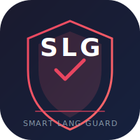

<div align="center">



# SmartLangGuard

**كتبت إنجليزي وانت ناوي عربي؟ الأداة دي بتصلحها لك في جزء من الثانية.**

`high hofhv;` → `اهلا اخبارك` ⚡

[](https://www.npmjs.com/package/@smartlangguard/cli)
[](https://github.com/ahmdelbaz28-ux/rewrite/actions)
[](https://github.com/ahmdelbaz28-ux/rewrite/releases/tag/v0.1.3)
[](LICENSE)
[](#-installation)

**[📦 تنزيل الإصدار 0.1.3](https://github.com/ahmdelbaz28-ux/rewrite/releases/tag/v0.1.3)** · **[npm](https://www.npmjs.com/package/@smartlangguard/cli)** · **[السجل](CHANGELOG.md)**

</div>

---

## ✨ آخر التحديثات (النسخة 0.1.3)

| التحديث | الوصف |
|---------|--------|
| 🧪 **240 اختبار ناجح** | كل الباكدجات تم اختبارها على Node 18/20/22 على GitHub Actions |
| 🐛 **إصلاح hang في MCP Server** | الـ readline بقي يتهيّا جوّه `startMcpServer()` بدل ما يعلّق الجست |
| 🔧 **إصلاح بناء CLI** | شيلنا conflict بين `--out-path` و`--output` في @yao-pkg/pkg |
| 🧩 **سكربتات VS Code محمولة** | استبدلنا المسار الثابت `/home/z/...` بسكربت جوّه الباكدج نفسه |
| 🌐 **سكربتات Browser Extension** | أنشأنا `scripts/build.js` و`scripts/package.js` اللي كانت ناقصة |
| 📦 **Artifacts جاهزة للتحميل** | CLI binary (Linux x64) + VSIX + ZIP في [صفحة الإصدارات](https://github.com/ahmdelbaz28-ux/rewrite/releases/tag/v0.1.3) |

---

## ✨ مميزات النسخة 0.2.0

| الميزة | الوصف |
|--------|--------|
| 🔍 **كشف النصوص المشروعة** | URLs, إيميلات, أكواد, مسارات ملفات، ألوان Hex، أرقام IP — كلها متتغيرش |
| 🌍 **دعم 3 أنواع كيبورد** | QWERTY (أمريكي), AZERTY (فرنسي), QWERTZ (ألماني) |
| 📖 **قاموس مستخدم ذكي** | الأداة بتتعلم من رفضك للتنبيهات — بعد 3 مرات بتضيف الكلمة تلقائي |
| 🔒 **أمان الـ Daemon** | رمز مصادقة (Token) لكل طلب API + CORS مقيد |
| 🚀 **تشغيل تلقائي** | اختياري: شغّل الأداة مع بدء تشغيل Windows/macOS/Linux |
| 🔔 **إشعارات Toast** | إشعارات غير مزعجة في الخلفية بدل الرسائل المنبثقة |
| 📚 **قاموس عربي موسّع** | أكتر من 500 كلمة + اللهجات: المصرية، الخليجية، الشامية |
| 🧠 **تحليل صرفي لاصق** | كشف الجذور العربية مع البادئات واللواحق (وبالكتب → كتب) |
| ⌨️ **كشف السياق** | الأداة بتفهم لو إنت بتكتب عربي أو إنجليزي من الكلمات السابقة |

---

## إيه الحكاية؟

تخيل إنك بتكتب عربي، لكن نسيت تغيّر لغة الكيبورد من إنجليزي لعربي.  
بدل ما تكتب **"اهلا اخبارك"** طلعت منك **"high hofhv;"** — وده غلط مش في الإملاء، ده غلط في **لغة الكيبورد**.

**SmartLangGuard** بيكتشف الغلطة دي **أوتوماتيك** ويصلحها لك من غير ما تعمل أي حاجة يدوي.

### الفكرة ببساطة

كل زر في الكيبورد بيلعب دورين:

| لما الكيبورد **إنجليزي** | نفس الزر لما الكيبورد **عربي** |
|:---:|:---:|
| `h` | `ا` |
| `i` | `ه` |
| `g` | `ل` |
| `h` | `ا` |

يعني **`high`** (بالإنجليزي) = **`اهلا`** (بالعربي) — نفس الأزرار بالظبط!

---

## المتطلبات (قبل ما تبدأ)

### 1. Node.js (محرك JavaScript)

الأداة محتاجة **Node.js** عشان تشتغل. ده برنامج مجاني بتثبته مرة واحدة.

**إزاي أتأكد إن عندي Node.js؟**

افتح **PowerShell** أو **Terminal** واكتب:
```bash
node --version
```

- لو ظهر رقم زي `v18.20.0` أو أعلى → تمام، عندك Node.js
- لو ظهر خطأ → محتاج تثبته

**إزاي أثبّت Node.js؟**

1. روح للموقع: [https://nodejs.org](https://nodejs.org)
2. اضغط على الزر الأخضر الكبير **"Download Node.js"** (اختار LTS)
3. شغّل الملف اللي نزل واضغط **Next → Next → Install → Finish**
4. افتح PowerShell تاني واكتب `node --version` — المفروض يظهر الرقم

### 2. تنزيل الأداة

عندك 3 طرق، اختار اللي يناسبك:

**الطريقة الأولى: npm (الأسهل والأسرع) ⭐**
```bash
npm install -g @smartlangguard/cli
```
بعد كده تقدر تستخدمها من أي مكان بالأمر `smartlangguard` أو `slg`.

**الطريقة الثانية: تحميل Binary جاهز (من غير Node.js)**
1. روح لـ [صفحة الإصدارات](https://github.com/ahmdelbaz28-ux/rewrite/releases/latest)
2. نزّل الملف المناسب لجهازك:
   - **Linux:** `smartlangguard-cli-0.1.3-linux-x64`
   - **Windows:** لما الإصدار يطلع رسمياً نزّل من Release
3. **Linux/Mac:** افتح Terminal ونفّذ:
   ```bash
   chmod +x smartlangguard-cli-0.1.3-linux-x64
   sudo mv smartlangguard-cli-0.1.3-linux-x64 /usr/local/bin/smartlangguard
   ```
4. جرّب: `smartlangguard --version`

**الطريقة الثالثة: من الكود المصدري (للمطورين)**
```bash
git clone https://github.com/ahmdelbaz28-ux/rewrite.git
cd rewrite
npm install
```

أو حمّل ZIP:
1. روح لـ [https://github.com/ahmdelbaz28-ux/rewrite](https://github.com/ahmdelbaz28-ux/rewrite)
2. اضغط **Code** (الزر الأخضر) → **Download ZIP**
3. فك الضغط عن الملف
4. افتح PowerShell/Terminal داخل المجلد واكتب:
```bash
npm install
```

> ⏱️ `npm install` بتاخد دقيقة أو اتنين. بتحمّل كل المكتبات اللي المشروع محتاجها.

---

## 10 طرق تستخدم بيها الأداة

---

### الطريقة 1: سطر الأوامر (CLI) — أبسط طريقة

> **مناسبة لـ:** تصحيح نص معين بسرعة من أي مكان

**خطوة بخطوة:**

**1.** افتح **PowerShell** (Windows) أو **Terminal** (Mac/Linux)
   - **Windows:** اضغط على كيبورد `Win + R`، اكتب `powershell`، اضغط Enter
   - **Mac:** افتح تطبيق **Terminal**

**2.** روح للمجلد بتاع المشروع:
```bash
cd c:\Users\EWS-01\Documents\Qoder\2026-06-22\chat-1\rewrite
```
> غيّر المسار ده حسب مكان المشروع عندك

**3.** اكتب الأمر ده لتصحيح نص:
```bash
node packages/cli/bin/smartlangguard.js fix "high hofhv;"
```

**النتيجة:**
```
اهلا اخبارك
```

**أمثلة إضافية:**

```bash
# كلمة واحدة
node packages/cli/bin/smartlangguard.js fix "high"
# النتيجة: اهلا

# بالعكس (عربي → إنجليزي) لو الكيبورد كان عربي وانت ناوي إنجليزي
node packages/cli/bin/smartlangguard.js fix "اهلا" -d ar-to-en
# النتيجة: high

# مع تفاصيل أكتر (نسبة الثقة + الاتجاه)
node packages/cli/bin/smartlangguard.js fix "high" --format text-with-meta
# النتيجة:
# اهلا
# [direction: en-to-ar | confidence: 90% | source: rules]

# بصيغة JSON (مفيدة للبرمجة)
node packages/cli/bin/smartlangguard.js fix "high" --format json
```

---

### الطريقة 2: الوضع التفاعلي (Interactive) — زي شات بوت

> **مناسبة لـ:** لو عايز تصحّح أكتر من نص ورا بعض

**خطوة بخطوة:**

**1.** افتح PowerShell وروح لمجلد المشروع (زي الطريقة 1)

**2.** اكتب:
```bash
node packages/cli/bin/smartlangguard.js interactive
```

**هتظهر لك:**
```
SmartLangGuard Interactive Mode
Type text and press Enter to fix. Type "exit" or Ctrl+D to quit.

smartlangguard>
```

**3.** اكتب أي نص واضغط **Enter**:
```
smartlangguard> high
→ اهلا
  [en-to-ar | 90% confidence | rules]
```

**4.** اكتب تاني:
```
smartlangguard> hofhv;
→ اخبارك
  [en-to-ar | 85% confidence | rules]
```

**5.** لما تخلص، اكتب `exit`:
```
smartlangguard> exit
Goodbye!
```

---

### الطريقة 3: اكتشاف الأخطاء من غير تصحيح (Detect)

> **مناسبة لـ:** لو عايز تشوف الأخطاء فين بالظبط من غير ما الأداة تعدّل

**خطوة بخطوة:**

```bash
node packages/cli/bin/smartlangguard.js detect "high hofhv;"
```

**النتيجة:**
```
Found 2 mistake(s):

  1. "high" → "اهلا" (en-to-ar) [pos 0-4]
  2. "hofhv;" → "اخبارك" (en-to-ar) [pos 5-11]
```

> بيقولك: لقيت غلطتين. الأولى "high" المفروض تكون "اهلا"، والتانية "hofhv;" المفروض تكون "اخبارك"

**بصيغة JSON:**
```bash
node packages/cli/bin/smartlangguard.js detect "high hofhv;" --format json
```

---

### الطريقة 4: تصحيح ملف كامل

> **مناسبة لـ:** لو عندك ملف نصي (txt, md) وفيه كلام مكتوب بالكيبورد الغلط

**خطوة بخطوة:**

**1.** جهّز ملف اسمه `myfile.txt` وحطّ فيه النص الغلط، مثلا:
```
high hofhv;
```

**2.** اكتب الأمر:
```bash
node packages/cli/bin/smartlangguard.js fix -f myfile.txt -o fixed.txt
```

**3.** افتح ملف `fixed.txt` — هتلاقي:
```
اهلا اخبارك
```

---

### الطريقة 5: من خلال Pipe (أوتوماتيك من برامج تانية)

> **مناسبة لـ:** لو عايز تربط الأداة مع أدوات تانية أو سكريبتات

```bash
# على Windows (PowerShell)
echo "high" | node packages/cli/bin/smartlangguard.js fix
# النتيجة: اهلا

# على Mac/Linux
echo "high" | node packages/cli/bin/smartlangguard.js fix
# النتيجة: اهلا
```

---

### الطريقة 6: Daemon (خدمة في الخلفية) — ⭐ الأنسب للمستخدم العادي

> **مناسبة لـ:** تشغيل الأداة في الخلفية عشان تراقب الـ Clipboard وتصلح أي نص تعمل له Copy

**الميزة الكبيرة:** بتشتغل في الخلفية وتراقب كل حاجة بتعملها Copy. ولو ضغطت `Ctrl+Shift+Space`، بتصلح الـ Clipboard فورًا.

**خطوة بخطوة:**

**1.** افتح PowerShell وروح لمجلد المشروع

**2.** شغّل الـ Daemon:
```bash
node packages/daemon/src/daemon.js
```

**هتظهر لك:**
```
+--------------------------------------------+
|  SmartLangGuard Daemon v0.2.0              |
|--------------------------------------------|
|  + Clipboard monitor: ACTIVE               |
|  + Global hotkey: Ctrl+Shift+Space         |
|  + Local API: http://localhost:41783        |
|  + Auth token: 34867282...                 |
+--------------------------------------------+
Press Ctrl+C to stop.
```

> ⚠️ **مهم:** 
> - خلي الـ Terminal ده مفتوح. لو قفلته، الـ Daemon هيقف.
> - الـ **Auth Token** ده لازم يتبعت مع كل طلب للـ API (الأمان)

**3.** جرّب:
   - انسخ أي نص إنجليزي (مثلا: `high hofhv;`)
   - اضغط **`Ctrl+Shift+Space`**
   - اعمل **Paste** (`Ctrl+V`) — هتلاقي النص اتصلح!

**4.** خيارات إضافية:
```bash
# تشغيل مع بدء التشغيل التلقائي
node packages/daemon/src/daemon.js --auto-start

# إيقاف التشغيل التلقائي
node packages/daemon/src/daemon.js --disable-auto-start

# من غير مراقبة Clipboard
node packages/daemon/src/daemon.js --no-clipboard
```

**5.** إيقاف الـ Daemon: اضغط `Ctrl+C` في الـ Terminal

---

### الطريقة 7: إضافة المتصفح (Browser Extension)

> **مناسبة لـ:** لو بتكتب كتير في المتصفح (Facebook, Twitter, Gmail, WhatsApp Web...)

**الأداة بتعمل إيه في المتصفح:**
- بتكتشف وانت بتكتب لو الكيبورد غلط
- بتديك صوت تنبيه
- بتصلح النص بضغطة واحدة: `Ctrl+Shift+Backspace`

**خطوة بخطوة:**

**1.** شغّل الـ Daemon الأول (الطريقة 6) — خليه شغال في الخلفية

**2.** افتح **Chrome** واكتب في شريط العنوان:
```
chrome://extensions
```

**3.** فعّل **Developer mode** (المفتاح في أعلى يمين الصفحة)

**4.** اضغط **Load unpacked**

**5.** اختار المجلد ده:
```
packages/browser-extension
```
(داخل مجلد المشروع)

**6.** هتلاقي أيقونة SmartLangGuard ظهرت في شريط الأدوات ✓

**إزاي تستخدمها:**

| عايز تعمل إيه؟ | إزاي |
|---|---|
| تصحّح نص محدّد | حدد النص → كليك يمين → **SmartLangGuard: Fix Selection** |
| اختصار سريع | حدد النص → `Ctrl+Shift+L` |
| تصحّح آخر كلمة كتبتها | وانت بتكتب → `Ctrl+Shift+Backspace` |
| تفتح الإعدادات | اضغط على الأيقونة → **Settings** |
| تفتح النافذة المنبثقة | اضغط على أيقونة SmartLangGuard في شريط الأدوات |

**لو ظهرت رسالة "Daemon offline":**
- تأكد إن الـ Daemon شغال (الطريقة 6)
- اضغط على الأيقونة → لازم تظهر "Daemon running"

---

### الطريقة 8: إضافة VS Code

> **مناسبة لـ:** لو بتكتب كود أو ملاحظات في VS Code وعايز تصحيح تلقائي

**خطوة بخطوة:**

**1.** ثبّت الـ CLI عالميًا:
```bash
npm install -g @smartlangguard/cli
```

**2.** افتح **VS Code**

**3.** اضغط `Ctrl+Shift+X` (عشان تفتح قسم الإضافات)

**4.** دوّر على `SmartLangGuard` واضغط **Install**

> لو مش لاقيها، ممكن تعمل Build من الكود:
> ```bash
> cd packages/vscode-extension
> npm run compile
> ```

**5.** بعد التثبيت، الأداة بتشتغل أوتوماتيك:

| عايز تعمل إيه؟ | إزاي |
|---|---|
| تصحّح النص المحدد | حدد النص → `Ctrl+Shift+P` → اكتب "Fix Selection" |
| تصحّح آخر كلمة | `Ctrl+Shift+Backspace` |
| تشوف الحالة | اضغط على "SmartLangGuard" في شريط الحالة (تحت) |
| تغيّر الصوت | `Ctrl+Shift+P` → "SmartLangGuard: Sound Selection" |

---

### الطريقة 9: MCP Server (مع أدوات الذكاء الاصطناعي)

> **مناسبة لـ:** لو بتستخدم Claude Desktop أو Cursor أو Cline وعايز الذكاء الاصطناعي يقدر يصحّح النص

**خطوة بخطوة:**

**1.** ثبّت الـ CLI:
```bash
npm install -g @smartlangguard/cli
```

**2.** افتح ملف إعدادات Claude Desktop:
   - **Windows:** `C:\Users\YOUR_NAME\AppData\Roaming\Claude\claude_desktop_config.json`
   - **Mac:** `~/Library/Application Support/Claude/claude_desktop_config.json`

**3.** أضف الكود ده:
```json
{
  "mcpServers": {
    "smartlangguard": {
      "command": "smartlangguard",
      "args": ["mcp"]
    }
  }
}
```

**4.** أعد تشغيل Claude Desktop

**5.** دلوقتي Claude يقدر يستخدم الأداة. جرب تقول له:
> "Fix this text: high hofhv;"

وهو بيرد عليك بـ: **"اهلا اخبارك"**

---

### الطريقة 10: Node.js API (للمبرمجين)

> **مناسبة لـ:** لو عايز تبني تطبيقك الخاص وتدمج الأداة جواه

**خطوة بخطوة:**

**1.** ثبّت المكتبة في مشروعك:
```bash
npm install @smartlangguard/core
```

**2.** اكتب الكود:
```javascript
const core = require('@smartlangguard/core');

// تهيئة (مرة واحدة)
await core.init({ telemetryEnabled: false });

// تصحيح نص
const result = await core.fixText('high hofhv;');
console.log(result.corrected);  // اهلا اخبارك
console.log(result.direction);  // en-to-ar
console.log(result.score);      // 88

// تصحيح بالعكس
const result2 = await core.fixText('اهلا', { direction: 'ar-to-en' });
console.log(result2.corrected); // high
```

---

## كل الأوامر في مكان واحد

| الأمر | بيعمل إيه |
|-------|----------|
| `fix "نص"` | يصحّح النص |
| `fix -f ملف.txt -o نتيجة.txt` | يصحّح ملف ويحط النتيجة في ملف تاني |
| `fix --format json "نص"` | يصحّح ويعرض النتيجة بصيغة JSON |
| `fix --format text-with-meta "نص"` | يصحّح ويعرض نسبة الثقة |
| `fix -d ar-to-en "اهلا"` | يصحّح بالعكس (عربي → إنجليزي) |
| `detect "نص"` | يكتشف الأخطاء من غير ما يصحّح |
| `interactive` | وضع تفاعلي (شات) |
| `daemon` | يشغّل خدمة في الخلفية |
| `mcp` | يشغّل MCP server للذكاء الاصطناعي |
| `license activate <رمز>` | يفعّل رخصة |
| `license status` | يعرض حالة الرخصة |
| `config set telemetry false` | يوقف التتبع |
| `update check` | يدور على تحديث |
| `sound play ding` | يشغّل صوت تنبيه |
| `sound list` | يعرض قائمة الأصوات |

---

## المميزات والباقات

| الميزة | مجاني | Pro ($5/شهر) |
|--------|:----:|:-----------:|
| تصحيح النصوص | ✅ | ✅ |
| CLI + Daemon + Hotkey | ✅ | ✅ |
| إضافة VS Code | ✅ | ✅ |
| إضافة المتصفح | ✅ | ✅ |
| كشف النصوص المشروعة (URLs, أكواد) | ✅ | ✅ |
| قاموس المستخدم الذكي | ✅ | ✅ |
| دعم 3 أنواع كيبورد | ✅ | ✅ |
| قاموس عربي 500+ كلمة + لهجات | ✅ | ✅ |
| تشغيل تلقائي مع النظام | ✅ | ✅ |
| تصحيح بالذكاء الاصطناعي (AI) | — | ✅ |
| عدد الأجهزة | 1 | 3 |
| دعم فني | — | ✅ أولوية |

---

## الأسئلة الشائعة

### س: الأداة بتبعت بياناتي لأي حد؟
**لا.** كل التصحيح بيتم **على جهازك**. مفيش بيانات بتتبعت لأي سيرفر.

### س: بتشتغل offline؟
**أيوا.** بعد ما تثبّت، الأداة بتشتغل من غير إنترنت.

### س: بتدعم لغات تانية غير العربي والإنجليزي؟
**لأ حاليًا.** بس العربي والإنجليزي. ممكن نضيف لغات تانية في المستقبل.

### س: إزاي أعرف الأداة شغالة؟
جرّب:
```bash
node packages/cli/bin/smartlangguard.js fix "high"
```
لو النتيجة طلعت `اهلا` → الأداة شغالة تمام ✓

---

## الاختبارات (Tests)

```bash
npm test                # 240 اختبار
npx jest --verbose      # تفاصيل أكتر
```

### إيه اللي بيتختبر؟
| الوحدة | عدد الاختبارات | بتختبر إيه |
|--------|:-:|--------|
| Core (Translator, AI, License, …) | 146 | تحويل الحروف، كشف الأخطاء، النصوص المشروعة، قاموس 500+ كلمة، التحليل الصرفي |
| Backend API | 35 | License, Telemetry, Billing, Admin JWT, Stripe, 404 |
| Daemon | 14 | API, Auth Token, CORS, تشغيل بدون crash |
| CLI | 14 | --version, --help, fix (stdin/arg/file), detect, كل صيغ الإخراج |
| Browser Extension | 11 | MV3 manifest, الصلاحيات الآمنة, build + zip |
| Admin Dashboard | 9 | vite build + الحزم الـ hashed |
| MCP Server | 6 | Protocol version, 4 tools (fix_text, fix_clipboard, register_license, license_status) |
| VS Code Extension | 5 | tsc compilation, exports activate/deactivate, portable paths |
| **الإجمالي** | **240** | **كل الباكدجات خضراء على Node 18/20/22** |

---

## الترخيص (License)

Proprietary — © 2026 SmartLangGuard.

[المشاكل والاقتراحات](https://github.com/ahmdelbaz28-ux/rewrite/issues) · [تواصل معنا](mailto:ahmdelbaz28@gmail.com)
<div align="center">

---

# 🇬🇧 English Guide

---

## ✨ Latest Updates (v0.1.3)

| Update | Description |
|--------|-------------|
| 🧪 **240 passing tests** | All packages verified on Node 18/20/22 via GitHub Actions |
| 🐛 **Fixed MCP Server hang** | `readline` is now created inside `startMcpServer()` instead of at module-load time (was keeping the event loop alive) |
| 🔧 **Fixed CLI build** | Removed `--out-path` + `--output` conflict in @yao-pkg/pkg |
| 🧩 **Portable VS Code scripts** | Replaced the hardcoded `/home/z/...` path with a portable script inside the package |
| 🌐 **Browser Extension scripts** | Created the missing `scripts/build.js` and `scripts/package.js` |
| 📦 **Downloadable artifacts** | CLI binary (Linux x64) + VSIX + ZIP available on the [releases page](https://github.com/ahmdelbaz28-ux/rewrite/releases/tag/v0.1.3) |

---

## ✨ v0.2.0 Features

| Feature | Description |
|-------------|-------------|
| 🔍 **False Positive Detection** | URLs, emails, code, file paths, hex colors, IP addresses are never touched |
| 🌍 **3 Keyboard Layouts** | QWERTY (US), AZERTY (French), QWERTZ (German) |
| 📖 **Smart User Dictionary** | Auto-learns from dismissed alerts — after 3 dismissals, word is whitelisted |
| 🔒 **Daemon Security** | Token-based API authentication + restricted CORS |
| 🚀 **Auto-start on Login** | Optional: start SmartLangGuard when Windows/macOS/Linux boots |
| 🔔 **Toast Notifications** | Non-blocking background notifications instead of modal dialogs |
| 📚 **500+ Arabic Words** | Expanded dictionary including Egyptian, Gulf, and Levantine dialects |
| 🧠 **Agglutinative Morphology** | Strips prefix + suffix to find Arabic roots (وبالكتب → كتب) |
| ⌨️ **Context Awareness** | Understands if you're typing Arabic or English from previous words |

---

## What's This?

Imagine you're typing in Arabic, but you forgot to switch your keyboard layout from English to Arabic.  
Instead of writing **"اهلا اخبارك"**, you end up with **"high hofhv;"** — this isn't a spelling mistake, it's a **keyboard language** mistake.

**SmartLangGuard** detects this error **automatically** and fixes it without any manual effort.

### The Simple Idea

Every key on your keyboard plays two roles:

| When keyboard is set to **English** | Same key when keyboard is set to **Arabic** |
|:---:|:---:|
| `h` | `ا` |
| `i` | `ه` |
| `g` | `ل` |
| `h` | `ا` |

So **`high`** (typed in English) = **`اهلا`** (in Arabic) — same exact keys!

---

## Prerequisites (Before You Start)

### 1. Node.js (the JavaScript runtime)

SmartLangGuard needs **Node.js** to run. It's a free program you install once.

**How to check if you have Node.js:**

Open **PowerShell** (Windows) or **Terminal** (Mac/Linux) and type:
```bash
node --version
```

- If you see a number like `v18.20.0` or higher → you're good to go
- If you see an error → you need to install it

**How to install Node.js:**

1. Go to: [https://nodejs.org](https://nodejs.org)
2. Click the big green **"Download Node.js"** button (choose LTS)
3. Run the downloaded file and click **Next → Next → Install → Finish**
4. Open PowerShell again and type `node --version` — you should now see the version number

### 2. Download the Tool

You have 3 options, pick whichever suits you:

**Option 1: npm (easiest and fastest) ⭐**
```bash
npm install -g @smartlangguard/cli
```
After that you can use it from anywhere via the `smartlangguard` or `slg` command.

**Option 2: Download a prebuilt binary (no Node.js required)**
1. Go to the [releases page](https://github.com/ahmdelbaz28-ux/rewrite/releases/latest)
2. Download the file that matches your machine:
   - **Linux:** `smartlangguard-cli-0.1.3-linux-x64`
   - **Windows:** once the official release is out, grab it from Releases
3. **Linux/Mac:** open Terminal and run:
   ```bash
   chmod +x smartlangguard-cli-0.1.3-linux-x64
   sudo mv smartlangguard-cli-0.1.3-linux-x64 /usr/local/bin/smartlangguard
   ```
4. Verify: `smartlangguard --version`

**Option 3: From source (for developers)**
```bash
git clone https://github.com/ahmdelbaz28-ux/rewrite.git
cd rewrite
npm install
```

Or download a ZIP:
1. Go to [https://github.com/ahmdelbaz28-ux/rewrite](https://github.com/ahmdelbaz28-ux/rewrite)
2. Click **Code** (green button) → **Download ZIP**
3. Extract the ZIP file
4. Open PowerShell inside the extracted folder and run:
```bash
npm install
```

> ⏱️ `npm install` takes a minute or two. It downloads all the libraries the project needs.

---

## 10 Ways to Use SmartLangGuard

---

### Method 1: Command Line (CLI) — the simplest way

> **Best for:** quickly fixing a piece of text from anywhere

**Step by step:**

**1.** Open **PowerShell** (Windows) or **Terminal** (Mac/Linux)
   - **Windows:** press `Win + R` on your keyboard, type `powershell`, press Enter
   - **Mac:** open the **Terminal** app

**2.** Navigate to the project folder:
```bash
cd path/to/your/rewrite/folder
```
> Change this path to wherever you extracted the project

**3.** Type this command to fix text:
```bash
node packages/cli/bin/smartlangguard.js fix "high hofhv;"
```

**Output:**
```
اهلا اخبارك
```

**More examples:**

```bash
# Fix a single word
node packages/cli/bin/smartlangguard.js fix "high"
# Output: اهلا

# Reverse direction (Arabic → English) if keyboard was Arabic but you meant English
node packages/cli/bin/smartlangguard.js fix "اهلا" -d ar-to-en
# Output: high

# Show more details (confidence + direction)
node packages/cli/bin/smartlangguard.js fix "high" --format text-with-meta
# Output:
# اهلا
# [direction: en-to-ar | confidence: 90% | source: rules]

# Output as JSON (useful for developers)
node packages/cli/bin/smartlangguard.js fix "high" --format json
```

---

### Method 2: Interactive Mode — like a chatbot

> **Best for:** fixing multiple texts one after another

**Step by step:**

**1.** Open PowerShell and navigate to the project folder (like Method 1)

**2.** Run:
```bash
node packages/cli/bin/smartlangguard.js interactive
```

**You'll see:**
```
SmartLangGuard Interactive Mode
Type text and press Enter to fix. Type "exit" or Ctrl+D to quit.

smartlangguard>
```

**3.** Type any text and press **Enter**:
```
smartlangguard> high
→ اهلا
  [en-to-ar | 90% confidence | rules]
```

**4.** Type another:
```
smartlangguard> hofhv;
→ اخبارك
  [en-to-ar | 85% confidence | rules]
```

**5.** When done, type `exit`:
```
smartlangguard> exit
Goodbye!
```

---

### Method 3: Detect Mistakes Without Fixing (Detect)

> **Best for:** finding exactly where the mistakes are without making changes

**Step by step:**

```bash
node packages/cli/bin/smartlangguard.js detect "high hofhv;"
```

**Output:**
```
Found 2 mistake(s):

  1. "high" → "اهلا" (en-to-ar) [pos 0-4]
  2. "hofhv;" → "اخبارك" (en-to-ar) [pos 5-11]
```

> It tells you: found 2 mistakes. The first "high" should be "اهلا", and "hofhv;" should be "اخبارك"

**As JSON:**
```bash
node packages/cli/bin/smartlangguard.js detect "high hofhv;" --format json
```

---

### Method 4: Fix an Entire File

> **Best for:** if you have a text file (.txt, .md) with text typed in the wrong keyboard layout

**Step by step:**

**1.** Create a file called `myfile.txt` and put the wrong text in it, for example:
```
high hofhv;
```

**2.** Run:
```bash
node packages/cli/bin/smartlangguard.js fix -f myfile.txt -o fixed.txt
```

**3.** Open `fixed.txt` — you'll find:
```
اهلا اخبارك
```

---

### Method 5: Pipe (automatic use from other programs)

> **Best for:** connecting the tool with other tools or scripts

```bash
# On Windows (PowerShell)
echo "high" | node packages/cli/bin/smartlangguard.js fix
# Output: اهلا

# On Mac/Linux
echo "high" | node packages/cli/bin/smartlangguard.js fix
# Output: اهلا
```

---

### Method 6: Daemon (background service) — ⭐ best for everyday users

> **Best for:** running the tool in the background to monitor your clipboard and fix any text you copy

**The big advantage:** it runs in the background and watches everything you copy. If you press `Ctrl+Shift+Space`, it fixes the clipboard instantly.

**Step by step:**

**1.** Open PowerShell and navigate to the project folder

**2.** Start the Daemon:
```bash
node packages/daemon/src/daemon.js
```

**You'll see:**
```
+--------------------------------------------+
|  SmartLangGuard Daemon v0.2.0              |
|--------------------------------------------|
|  + Clipboard monitor: ACTIVE               |
|  + Global hotkey: Ctrl+Shift+Space         |
|  + Local API: http://localhost:41783        |
|  + Auth token: 34867282...                 |
+--------------------------------------------+
Press Ctrl+C to stop.
```

> ⚠️ **Important:**
> - Keep this terminal window open. If you close it, the Daemon stops.
> - The **Auth Token** must be sent with every API request (security)

**3.** Try it:
   - Copy any English text (e.g., `high hofhv;`)
   - Press **`Ctrl+Shift+Space`**
   - Paste (`Ctrl+V`) — you'll see the text is now fixed!

**4.** Extra options:
```bash
# Start with auto-start on login enabled
node packages/daemon/src/daemon.js --auto-start

# Disable auto-start
node packages/daemon/src/daemon.js --disable-auto-start

# Without clipboard monitoring
node packages/daemon/src/daemon.js --no-clipboard
```

**5.** To stop the Daemon: press `Ctrl+C` in the terminal

---

### Method 7: Browser Extension

> **Best for:** if you write a lot in the browser (Facebook, Twitter, Gmail, WhatsApp Web...)

**What the extension does in the browser:**
- Detects while you type if the keyboard layout is wrong
- Plays an alert sound
- Fixes text with one keystroke: `Ctrl+Shift+Backspace`

**Step by step:**

**1.** Start the Daemon first (Method 6) — keep it running in the background

**2.** Open **Chrome** and type in the address bar:
```
chrome://extensions
```

**3.** Turn on **Developer mode** (toggle in the top-right corner)

**4.** Click **Load unpacked**

**5.** Select this folder:
```
packages/browser-extension
```
(inside the project folder)

**6.** You'll see the SmartLangGuard icon appear in the toolbar ✓

**How to use it:**

| What you want to do | How |
|---|---|
| Fix selected text | Select text → right-click → **SmartLangGuard: Fix Selection** |
| Quick shortcut | Select text → `Ctrl+Shift+L` |
| Fix the last word you typed | While typing → `Ctrl+Shift+Backspace` |
| Open settings | Click the icon → **Settings** |
| Open the popup | Click the SmartLangGuard icon in the toolbar |

**If you see "Daemon offline":**
- Make sure the Daemon is running (Method 6)
- Click the icon → it should show "Daemon running"

---

### Method 8: VS Code Extension

> **Best for:** if you write code or notes in VS Code and want automatic correction

**Step by step:**

**1.** Install the CLI globally:
```bash
npm install -g @smartlangguard/cli
```

**2.** Open **VS Code**

**3.** Press `Ctrl+Shift+X` (to open the Extensions panel)

**4.** Search for `SmartLangGuard` and click **Install**

> If you can't find it, you can build from source:
> ```bash
> cd packages/vscode-extension
> npm run compile
> ```

**5.** After installation, the tool works automatically:

| What you want to do | How |
|---|---|
| Fix selected text | Select text → `Ctrl+Shift+P` → type "Fix Selection" |
| Fix last word | `Ctrl+Shift+Backspace` |
| Check status | Click "SmartLangGuard" in the status bar (bottom) |
| Change alert sound | `Ctrl+Shift+P` → "SmartLangGuard: Sound Selection" |

---

### Method 9: MCP Server (with AI tools)

> **Best for:** if you use Claude Desktop, Cursor, or Cline and want AI to fix text for you

**Step by step:**

**1.** Install the CLI:
```bash
npm install -g @smartlangguard/cli
```

**2.** Open the Claude Desktop config file:
   - **Windows:** `C:\Users\YOUR_NAME\AppData\Roaming\Claude\claude_desktop_config.json`
   - **Mac:** `~/Library/Application Support/Claude/claude_desktop_config.json`

**3.** Add this configuration:
```json
{
  "mcpServers": {
    "smartlangguard": {
      "command": "smartlangguard",
      "args": ["mcp"]
    }
  }
}
```

**4.** Restart Claude Desktop

**5.** Now Claude can use the tool. Try asking:
> "Fix this text: high hofhv;"

And it will respond with: **"اهلا اخبارك"**

---

### Method 10: Node.js API (for developers)

> **Best for:** if you want to build your own app and integrate the tool inside it

**Step by step:**

**1.** Install the library in your project:
```bash
npm install @smartlangguard/core
```

**2.** Write the code:
```javascript
const core = require('@smartlangguard/core');

// Initialize (once)
await core.init({ telemetryEnabled: false });

// Fix text
const result = await core.fixText('high hofhv;');
console.log(result.corrected);  // اهلا اخبارك
console.log(result.direction);  // en-to-ar
console.log(result.score);      // 88

// Reverse direction
const result2 = await core.fixText('اهلا', { direction: 'ar-to-en' });
console.log(result2.corrected); // high
```

---

## All Commands in One Place

| Command | What it does |
|---------|-------------|
| `fix "text"` | Fix the text |
| `fix -f file.txt -o output.txt` | Fix a file and save the result to another file |
| `fix --format json "text"` | Fix and output the result as JSON |
| `fix --format text-with-meta "text"` | Fix and show the confidence level |
| `fix -d ar-to-en "اهلا"` | Reverse direction (Arabic → English) |
| `detect "text"` | Find mistakes without fixing them |
| `interactive` | Interactive (chat) mode |
| `daemon` | Run as a background service |
| `mcp` | Run the MCP server for AI tools |
| `license activate <token>` | Activate a license |
| `license status` | Show license status |
| `config set telemetry false` | Disable telemetry |
| `update check` | Check for updates |
| `sound play ding` | Play an alert sound |
| `sound list` | List available sounds |

---

## Features & Pricing

| Feature | Free | Pro ($5/mo) |
|---------|:----:|:-----------:|
| Text correction | ✅ | ✅ |
| CLI + Daemon + Hotkey | ✅ | ✅ |
| VS Code Extension | ✅ | ✅ |
| Browser Extension | ✅ | ✅ |
| False positive detection (URLs, code) | ✅ | ✅ |
| Smart user dictionary | ✅ | ✅ |
| 3 keyboard layouts | ✅ | ✅ |
| 500+ word Arabic dictionary + dialects | ✅ | ✅ |
| Auto-start on login | ✅ | ✅ |
| AI-powered scoring | — | ✅ |
| Number of devices | 1 | 3 |
| Priority support | — | ✅ |

---

## Frequently Asked Questions

### Q: Does the tool send my data anywhere?
**No.** All correction happens **on your device**. No data is sent to any server.

### Q: Does it work offline?
**Yes.** Once installed, the tool works without internet.

### Q: Does it support languages other than Arabic and English?
**Not yet.** Only Arabic and English for now. Other languages may be added in the future.

### Q: How do I know the tool is working?
Try this:
```bash
node packages/cli/bin/smartlangguard.js fix "high"
```
If the output is `اهلا` → the tool is working perfectly ✓

---

## Tests

```bash
npm test                # 240 tests
npx jest --verbose      # more details
```

### What's tested?
| Module | Tests | What's tested |
|--------|:-:|--------|
| Core (Translator, AI, License, …) | 146 | char mapping, mistake detection, false positives, 500+ word dictionary, morphology |
| Backend API | 35 | License, Telemetry, Billing, Admin JWT, Stripe, 404 |
| Daemon | 14 | API, auth token, CORS, clean startup/shutdown |
| CLI | 14 | --version, --help, fix (stdin/arg/file), detect, all output formats |
| Browser Extension | 11 | MV3 manifest, safe permissions, build + zip packaging |
| Admin Dashboard | 9 | vite build + hashed bundles |
| MCP Server | 6 | protocol version, 4 tools (fix_text, fix_clipboard, register_license, license_status) |
| VS Code Extension | 5 | tsc compilation, exports activate/deactivate, portable paths |
| **Total** | **240** | **all green on Node 18/20/22** |

---

## License

Proprietary — © 2026 SmartLangGuard.

[Issues & Suggestions](https://github.com/ahmdelbaz28-ux/rewrite/issues) · [Contact Us](mailto:ahmdelbaz28@gmail.com)
